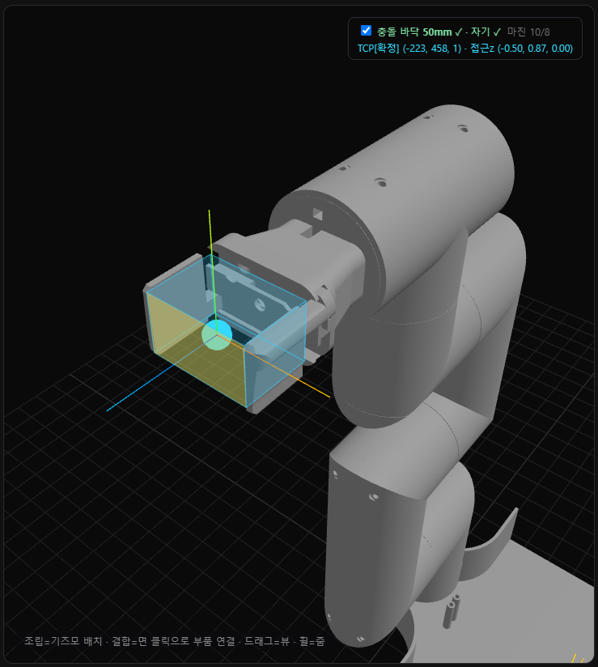

# 데이터 기반 파지 IK — 방법론 도출 과정과 최종 정식화

> **요지:** 정밀 DH가 없는 자작 6축 팔에서, **보정된 디지털 트윈이 자기 자신을 수만 번 관측해 만든 데이터**로
> "물체 위치 + 접근 자세 → 충돌 없는 관절각"을 푼다. 해석적 IK 대신 **순기구학(FK) 샘플링 + 자세 인지 최근접 탐색**을
> 채택하고, 실패 모드를 하나씩 제거하며 비용함수를 진화시켰다. 본 문서는 **그 도출 과정(왜 각 항이 필요했는가)** 과
> **최종 정식화**를 정리한다.

관련: [9_grasp_pipeline.md](9_grasp_pipeline.md)(구현 명세) · [6_digital_twin_safety.md](6_digital_twin_safety.md) · [4_measurement_validation.md](4_measurement_validation.md)

---

## 1. 문제 정의

6-DOF 관절각 $\theta=(\theta_1,\dots,\theta_6)$ 에 대해 그리퍼 **공구중심(TCP)** 의 포즈를 순기구학으로 얻을 수 있다:

$$p(\theta)=M_{\text{part}}(\theta)\,t_{\text{local}},\qquad R(\theta)=R_{\text{part}}(\theta)\,q_{\text{local}}$$

- $M_{\text{part}}(\theta)$ : 그리퍼가 고정된 STL 부품의 월드 변환(트윈 FK)
- $t_{\text{local}}$ : 부품 로컬에서의 TCP 위치(사용자 지정), $q_{\text{local}}$ : 부품 로컬에서의 TCP **프레임 자세**(확정 시 고정)
- 접근축 $a(\theta)=R(\theta)\,\hat z$ (그리퍼가 물체로 향하는 방향, 프레임 z축)

**목표(역문제):** 물체 위치 $p^\*$ 와 원하는 접근 자세 $q^\*$ 가 주어질 때, **충돌 없이** 그 포즈를 만드는 $\theta$ 를 찾는다.
해석적 IK는 정밀 링크 길이·구면손목을 요구하나 본 팔은 둘 다 불확실 → **데이터 기반 역탐색**을 택한다.

---

## 2. 데이터 생성 — FK 샘플링 (관측)

트윈에서 관절을 균일 무작위로 $N$ 회($N{=}10^5$) 쓸어, 각 자세를 관측·기록한다:

$$\mathcal D=\{(\theta^i,\,p^i,\,q^i,\,a^i,\,c^i)\}_{i=1}^{N},\qquad
c^i=\big[\,\text{floor}(\theta^i)<0\ \lor\ \text{self}(\theta^i)<0\,\big]$$

$c^i$ 는 디지털 트윈의 **정확한 기하 충돌검사**(`_collideOnce`, 바닥·자기충돌) 라벨. 충돌 없는 집합 $\mathcal D_{\text{free}}=\{i:c^i=0\}$.
이는 사람이 라벨하지 않은 **자가생성(self-supervised)** 데이터이며, sim-real 마진(바닥 30 mm)으로 "시뮬 안전 ⇒ 실물 안전"이 보증된다.

> **핵심:** $q^i$ 는 단순 접근벡터가 아니라 **그리퍼 프레임 전체 쿼터니언**이다(§3에서 그 필요성이 드러난다).

---

## 3. 비용함수의 진화 — 실패 모드를 제거한 과정 ★

본 연구의 방법론적 기여는 **하나의 비용함수를 단번에 설계한 것이 아니라, 시뮬에서 드러난 실패를 관측하며 항을 더해 간 것**이다.

### v1. 위치 최근접 (position-only)
$$\theta^\*=\theta^{\arg\min_{i\in\mathcal D_{\text{free}}}\ \lVert p^i-p^\*\rVert}$$
**실패:** TCP가 물체에 닿기만 하면 그리퍼 방향이 임의 → "물체 주변으로 가기만 하고 잡는 자세가 아님". 방향 제약 필요.

### v2. 위치 + 접근축 (approach-axis)
접근축 $a^\*=R(q^\*)\hat z$ 와의 정렬을 콘($35^\circ$)으로 필터:
$$\min_{i}\ \lVert p^i-p^\*\rVert + w\,\angle(a^i,a^\*)\quad\text{s.t.}\ \ a^i\!\cdot a^\* > \cos 35^\circ$$
**실패:** 접근축은 맞아도 **축 둘레 회전(roll)이 자유** → 손목이 접힌 기괴한 자세(예 $J_4{=}149^\circ,J_5{=}155^\circ$)도 통과. **자세 전체** 제약 필요 → 데이터에 $q^i$ 기록(재스윕).

### v3. 위치 + 전체 자세 (full 6-DOF)
측지 각거리 $d_q(q_1,q_2)=2\arccos|q_1\!\cdot q_2|$ 로 자세 전체를 매칭:
$$\theta^\*=\theta^{\arg\min_{i}\big[\lVert p^i-p^\*\rVert + w\,d_q(q^i,q^\*)\big]},\qquad \text{s.t.}\ d_q(q^i,q^\*)<\tau\ (\tau{=}45^\circ)$$
**효과:** roll까지 맞춰 **의도한 깔끔한 파지 자세**. **실패(잔존):** 목표 자세 $q^\*$ 를 **고정 프리셋 공식**으로 주니(예 "수평=베이스쪽 수평"), 물체 위치에 따라 **실제 도달 가능한 방향과 어긋남** → 근처에 후보가 많아도 "도달 불가"(실측: 같은 위치에 수평 후보 143개가 있는데 IK는 299 mm 미스).

### v4. 데이터 기반 자세 스냅 (reachability-aware) — 최종
프리셋 공식을 버리고, **그 위치에서 실제 도달 가능한 자세를 데이터에서 가져온다.** 접근 종류 $c\in\{\text{수직},\text{수평}\}$ 에 대해
$$q^\*(c,p^\*)=q^{\arg\min_{i\in\mathcal D_{\text{free}},\,\text{class}(a^i)=c}\ \lVert p^i-p^\*\rVert},\qquad
\text{class}(a)=\begin{cases}\text{수직}& a_y<-0.6\\[2pt]\text{수평}& |a_y|<0.4\end{cases}$$
이렇게 얻은 $q^\*$ 로 v3 을 풀면 **항상 도달 가능한 자세**가 나온다(그 위치에 종류 $c$ 후보가 없으면 명시적으로 "불가" 보고 — §5의 capability 와 일관).

> **교훈:** "원하는 자세를 공식으로 지정"하는 것보다 **"가능한 자세를 데이터에서 찾아 제시"** 하는 편이, 위치 의존적 도달성을 자연히 존중한다.

---

## 4. 경로 정식화 — 충돌 없는 전환 (P4)

IK 가 주는 것은 *목표 자세*일 뿐, 거기까지의 **이동 경로**는 별도다. 직선 보간 $\ell(\theta_a,\theta_b,t)=(1-t)\theta_a+t\theta_b$ 가
중간에서 바닥을 뚫을 수 있다(수직↔수평 전환). 경로 안전성:

$$\text{clear}(\theta_a,\theta_b)=\bigwedge_{t\in\{1/m,\dots,1\}}\neg\,\text{collide}\big(\ell(\theta_a,\theta_b,t)\big)\quad(\sim3^\circ\ \text{간격})$$

경로 계획 $\Pi(\theta_{\text{from}},\theta_{\text{to}})$:
$$\Pi=\begin{cases}[\theta_{\text{to}}] & \text{clear}(\theta_{\text{from}},\theta_{\text{to}})\\[2pt]
[w,\theta_{\text{to}}] & \exists\,w\in\mathcal W:\ \text{clear}(\theta_{\text{from}},w)\land\text{clear}(w,\theta_{\text{to}})\\[2pt]
\varnothing & \text{(안전 경로 없음 → 보고)}\end{cases}$$

경유점 후보 $\mathcal W=\{\,\text{업라이트}(90^\circ{\times}6),\ \text{어깨·팔꿈치 들기}\,\}$ — 바닥 여유가 큰 자세. 큐를 순차 추종.
**위치(L2 ladder):** 이는 학습이 아닌 **휴리스틱 + 정확 충돌검사**다. "데이터 기반 최적 경로"는 비용기반 탐색(RRT\*) 또는 **RL 모션 정책**(L2)으로의 확장 대상이다(§7).

---

## 5. 방향 조건부 도달영역 (capability map)

같은 위치라도 수직/수평 가능 여부가 다르다. 작업공간을 복셀 $v$ 로 나눠
$$\text{feasible}(v,c)=\big|\{\,i\in\mathcal D_{\text{free}}:\ \text{vox}(p^i)=v,\ \text{class}(a^i)=c\,\}\big|\ge k$$
로 정의(런타임 조회는 가장자리 양자화를 피해 **반경 스캔**). 이는 **AI 접근전략 결정의 근거이자 타당성 검증층**이다:
AI가 접근 종류를 제안 → capability 가 그 위치에서 가능한지 검증 → 6-DOF IK 가 자세 해석 → P4 가 경로.

---

## 6. 실측 결과

| 항목 | 값 (디지털 트윈, $N{=}10^5$) |
|------|------|
| 충돌 없는 자세 비율 | 91.5% (충돌 8.5%) |
| 작업공간 | 반구형 X[−415,376] Y[13,527] Z[−408,407] mm |
| 위치 최근접 잔차(밀도) | 중앙 **5.7 mm** |
| **6-DOF IK 잔차**(자세 $45^\circ$ 이내) | 위치 중앙 **11 mm**·90p 21 mm·후보없음 0 |
| 〃 ($30^\circ$ / $20^\circ$ 이내) | 14 mm / 20 mm |
| capability(복셀 35 mm) | 수직만 475 · 수평만 1506 · 둘다 1678 |

→ **방향(roll)까지 제약해도 위치 잔차 ~11 mm**(sim-real 마진 30 mm 안) = 깔끔한 파지 자세를 정밀하게 해석. 접근 종류별 도달영역이 정량적으로 분리됨(수평만 영역이 큼 = 측면 접근 가용지가 넓음).

---

## 7. 학술적 위치 / 한계 / 향후

- **자가생성 데이터 기반 역기구학:** 정밀 모델 없이, 보정된 트윈의 자기관측으로 IK·도달성·파지 자세를 푼다. C-space 충돌예측층과 동일 철학(저비용 웹캠+STL 트윈).
- **방법론 도출의 정직성:** 비용함수는 **실패 모드(임의 자세 → roll 접힘 → 도달성 무시)를 관측하며 항을 더해** 최종형(데이터 스냅)에 이르렀다 — 일종의 **절제 실험(ablation) 서사**.
- **데이터 기반의 경계:** *잡는 자세*는 데이터 기반(관측 조회)이나, *움직이는 경로*는 아직 휴리스틱이다. 진정한 "데이터 기반 최적 경로"는
  ① 같은 충돌 데이터 위 **비용기반 탐색(RRT\*/A\*)**, ② 보정 트윈에서의 **RL 모션 정책(L2)** 으로의 확장으로 달성된다. 트윈은 그 전제조건을 이미 충족한다.
- **향후:** 파지 시퀀스(프리그래스프→접근→닫기→들기) 완성 → 비용 최적화 → RL → AI 서버 자연어 파이프라인에 capability·IK·경로 연결.

> 수치·정식화는 2026-06-19 실측 기준. 조립·보정·TCP 변경 시 재스윕으로 갱신.
