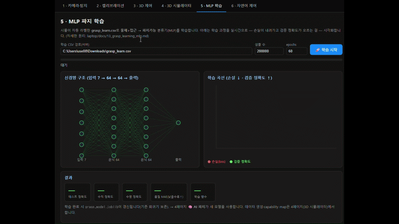

# 파지 학습 MLP — 무엇을 참고했고, 무엇을 얻기 위해 쓰는가

> **요지:** 디지털 트윈이 **가상 jaw로 자동 라벨링한 파지 데이터**(`grasp_learn.csv`)로, 작은 신경망
> (scikit-learn MLP)을 학습해 **"물체(위치·형상·크기) + 접근(수직/수평) → 잡을 수 있나"** 를 즉시
> 판정하고, **수직 vs 수평 접근을 스스로 선택**하게 만든다. C-space 충돌예측 신경망과 **같은 레시피**를
> 파지에 적용한 것이다. 구현: [`calibration/grasp_learn.py`](../calibration/grasp_learn.py).

관련: [12_grasp_orientation_learning.md](12_grasp_orientation_learning.md) · [6_digital_twin_safety.md](6_digital_twin_safety.md) · [11_gripper_design.md](11_gripper_design.md)

---

## 1. 무엇을 참고했나 (토대)

| 토대 | 내용 | 본 프로젝트에서의 역할 |
|------|------|------------------------|
| **자체 선행연구 — C-space 충돌예측** ([6_digital_twin_safety.md](6_digital_twin_safety.md), `cspace_learn.py`) | 시뮬이 스스로 만든 충돌지도로 MLP가 "관절각 → 안전/위험"을 학습(정확도 98.9%) | **동일 레시피를 파지에 그대로 적용.** 라벨러만 충돌검출 → **가상 jaw 파지검출**로 교체 |
| **FK 샘플링 파지 DB** ([9_grasp_pipeline.md](9_grasp_pipeline.md)) | 해석적 IK 대신 디지털 트윈으로 관절각↔TCP 포즈를 샘플링한 데이터베이스 | 학습 데이터의 **도달 가능 자세 후보** 공급원 |
| **가상 jaw 파지 모델** ([11_gripper_design.md](11_gripper_design.md), §본 문서 3) | 그리퍼 손가락 사이의 파지 영역을 TCP 기준 박스로 모델링 → 끝으로 잡아도 유효, 깊을수록 안전 | 데이터의 **성공/실패 자동 라벨러** (사람 개입 없음) |
| **scikit-learn** (`MLPClassifier`, `MLPRegressor`, `StandardScaler`) | 다층 퍼셉트론·표준화 등 표준 ML 도구 | 모델 구현 라이브러리 |
| **다층 퍼셉트론(MLP) · 오차역전파 · 지도학습** | 입력→은닉층→출력, forward/backprop/경사하강으로 가중치 최적화 | 모델의 학습 원리 |
| **평행집게 antipodal 파지** 개념 | 두 손가락이 물체를 양쪽에서 감싸야 안정 파지 | 라벨 기준(파지 유효성)의 물리적 근거 |

> 핵심 사상은 **"의미는 위로, 결정적·실시간은 아래로"**([architecture](../../docs/1_architecture.md))의 연장 —
> 무거운 검색·시뮬을 **오프라인 학습**으로 압축해, 런타임엔 µs급으로 질의한다.

---

## 2. 입력 데이터 — `grasp_learn.csv`

디지털 트윈(arm3d, 4페이지 "파지 학습 데이터 생성")이 **물체를 워크스페이스 곳곳·바닥에 놓고**, 각 물체마다
**수직·수평 접근을 둘 다 시도**해 가상 jaw로 자동 라벨링한다(물체당 2행).

| 열 | 의미 | 용도 |
|----|------|------|
| `obj_x,obj_y,obj_z` | 물체 중심 3D 위치(mm, 바닥에 놓임: y=바닥+H/2) | **입력 특징** |
| `type, R, H` | 형상(0=원기둥…)·반경·높이 | **입력 특징** |
| `approach` | 0=수직(top-down)·1=수평(side) | **입력 특징** |
| `success` | jaw 안에 잡히면 1, 아니면 0 | **분류 정답(y)** |
| `perp` | 닫힘축 중심오차(정렬) | 품질 진단 |
| `secure` | 베이스로부터 깊이(0=깊음·안전 … 클수록 끝·얕음) | 파지 **안전도**(향후 학습 대상) |
| `J1…J6` | 그 파지의 관절각(성공 시) | **회귀 정답** |

**자동 라벨 규칙(가상 jaw):** 물체 중심을 TCP/jaw 로컬로 변환해 ① 벌림 W 안에 들어오고(2R≤W) ②
닫힘축 중심에 있고 ③ jaw 깊이·높이 안이면 = **파지 성공**. 그리퍼 손끝 면까지 닿으면 최소 파지로 인정,
TCP(베이스)에 가까울수록 `secure`(안전)가 좋다. → [11_gripper_design.md](11_gripper_design.md).

---

## 3. 모델 구조와 전처리

```
입력 X = [obj_x, obj_y, obj_z, type, R, H, approach]   (7차원)
        │  StandardScaler (평균0·분산1 정규화)
        ▼
   [MLP 은닉층 64 → 64, ReLU]
        ▼
 분류기 출력: P(파지 가능)        회귀기 출력: J1…J6 (성공 샘플만)
```

- **정규화(StandardScaler):** 위치(±400)·반경(5~35)처럼 스케일이 다른 특징을 같은 크기로 맞춰, 큰 값이
  학습을 지배하지 않게 한다.
- **train/test 분리:** 80% 학습 / 20% 평가(`stratify`로 성공·실패 비율 유지) → **외운 게 아니라 일반화**했는지 측정.

---

## 4. 학습 방법 (MLP가 배우는 원리)

데이터 한 묶음마다 다음을 수백 번(`max_iter`) 반복한다.

1. **순전파(forward):** 입력 × 가중치 + 편향 → ReLU(비선형) → 예측 확률
2. **손실(loss):** 예측 vs 정답의 오차(분류=cross-entropy, 회귀=MSE)
3. **역전파(backprop):** 오차를 줄이려면 각 가중치를 **어느 방향**으로 바꿀지 미분으로 계산
4. **경사하강(gradient descent):** 그 방향으로 가중치를 조금씩 갱신

반복하면 가중치가 "이런 위치·형상·접근이면 잡힌다/아니다"의 패턴을 담는다. 비선형(ReLU) 은닉층이
있어 **단순 직선 경계로 못 나누는 복잡한 파지가능 영역**(고리·바닥제약 등)도 근사할 수 있다.



> 🎬 데모 영상: [MLP 파지 학습](https://drive.google.com/file/d/1riFp9NCgwCPHXfsDhdb2TVaCAP688P8R/view?usp=sharing)

---

## 5. 얻는 결과값 (출력)과 성능

| 모델 | 입력 → 출력 | 성능(166k행·반경≤30 기준) |
|------|-------------|---------------------------|
| **분류기** | 물체+접근 → **파지 가능?**(확률) | 테스트 정확도 **92.7%** (수직 92.3·수평 93.2) |
| **접근 선택** | 물체 → `P(수직)` vs `P(수평)` 비교 → **수직/수평 결정** | 결정적 물체 정확도 **86.8%** |
| **회귀기** | 물체 → **관절각 J1…J6**(초기 자세) | MAE **31.6°**(다봉성 — 런타임 IK/검색 보정 전제) |

- **분류기**가 핵심 산출물 — C-space 안전지도의 **파지 버전(capability map)**.
- **접근 선택**은 분류기를 수직·수평 두 번 질의해 argmax → "AI가 형상·위치로 접근 방식을 판단".
- 산출 파일: `calibration/grasp_model.joblib`(분류기·회귀기·스케일러), `docs/image/grasp-learned.png`(수직·수평 맵),
  `grasp-learned-3d.png`(3D 파지가능 영역).

실행:
```bash
python calibration/grasp_learn.py <grasp_learn.csv>   # 학습+평가+그림+모델저장 일괄
```

---

## 6. 무엇을 위해 쓰는가 (용도)

**런타임 자동 파지의 "판단·제안층"** 이다(= 파지용 AI 검증층):

```
비전(3D 좌표 + 형상 R·H·type)
   → 분류기로 수직·수평 파지가능 즉시 판정 → 더 높은 접근 선택
   → 회귀기로 초기 관절각 제안 → IK/검색으로 정밀 보정 → 실행(J1~J6 + 그리퍼)
```

수천 자세를 매번 검색하지 않고 **µs급 추론으로 "잡을 수 있나 + 어떻게"** 를 답한다. AI 서버가 명령을
내릴 때, 노트북이 이 모델로 **실물 실행 전에 파지 타당성을 검증**한다.

---

## 7. 한계와 다음

- **회귀 다봉성:** 한 물체에 여러 파지가 있어 관절각 직접 예측은 평균이 됨(MAE 31°) → 런타임 검색/IK로 보정.
- **`secure`(안전도) 학습 미적용:** 현재는 가능/불가만 학습. 깊이(안전)까지 회귀·랭킹으로 학습하면 "더
  안전한 파지" 선택 가능.
- **능동학습 미적용:** 모델이 애매한(P≈0.5 경계) 물체를 골라 시뮬로 재라벨·재학습하면 경계 정확도↑
  (C-space 능동학습과 동일).
- **데이터 충실도:** 가상 jaw·바닥 기준이 실제 그리퍼와 정확히 맞아야 함(시각 조절·저장으로 보정).
- **다음 단계:** 런타임 'AI 파지 제안'(Django 엔드포인트로 모델 서빙) → 능동학습 → 실물 검증.

---

## 8. 손목(J6) roll 최적화 — 문헌 근거

6-DOF 파지 자세는 **접근축(approach) + 그 축 둘레의 roll 각도**로 정해지며, 이 **roll(우리 팔의 J6/손목)**
을 명시적으로 샘플·최적화하는 것이 6-DOF 파지 생성 연구의 공통 원리다([R1]~[R4]).

- **Approach-based 샘플링([R2]):** 표면 법선에 그리퍼를 정렬(접근 콘 반각 이내) + 접근각·**roll 각도**를 샘플.
- **Antipodal 샘플링([R2][R3]):** 표면 접촉점 쌍을 잡고 그 축 둘레 **roll 회전**을 샘플 → force-closure로 평가.

**본 프로젝트 적용:** FK-샘플링 DB는 J6가 균일 랜덤이라 밀도가 낮으면 잘 정렬된 roll을 못 찾는다. 그래서
런타임 'AI 파지'에서 DB 최적 자세를 찾은 뒤, **손목(J4·J5·J6)을 국소 hill-climb으로 미세조정해 jaw
정렬(닫힘축 중심오차)을 최소화**한다(`_refineWrist`, 충돌 시 원본 복귀). 근본 개선은 **더 조밀한 DB** 또는
**객체 중심 antipodal+roll 생성**([R2][R3])이다.

---

## 9. 참고문헌

**6-DOF 파지 자세 생성 · roll/접근 샘플링**
- [R1] A. Mousavian, C. Eppner, D. Fox. *6-DOF GraspNet: Variational Grasp Generation for Object Manipulation.* ICCV 2019. <https://openaccess.thecvf.com/content_ICCV_2019/papers/Mousavian_6-DOF_GraspNet_Variational_Grasp_Generation_for_Object_Manipulation_ICCV_2019_paper.pdf>
  — 파지 자세를 변분 생성. 접근+roll 6-DOF 표현의 대표 연구.
- [R2] J. Huber et al. *Speeding up 6-DoF Grasp Sampling with Quality-Diversity.* arXiv:2403.06173, 2024. <https://arxiv.org/pdf/2403.06173>
  — **approach-based/antipodal 샘플링의 파라미터(접근각·콘 회전·roll 각도)** 를 명시. 본 프로젝트의 roll(J6) 최적화 근거.
- [R3] *QuickGrasp: Lightweight Antipodal Grasp Planning with Point Clouds.* arXiv:2504.19716, 2025. <https://arxiv.org/html/2504.19716v1>
  — 점군에서 antipodal 파지 계획(경량). 접촉점+roll 샘플링·force-closure.
- [R4] *GraNet: A Multi-Level Graph Network for 6-DoF Grasp Pose Generation in Cluttered Scenes.* arXiv:2312.03345, 2023. <https://arxiv.org/pdf/2312.03345>
  — 군집 장면 6-DOF 파지 생성(그래프 신경망).

**학습 도구 · 방법론**
- [R5] F. Pedregosa et al. *Scikit-learn: Machine Learning in Python.* JMLR 12, 2011. <https://jmlr.org/papers/v12/pedregosa11a.html>
  — 본 프로젝트의 `MLPClassifier`/`MLPRegressor`/`StandardScaler` 구현 라이브러리.
- [R6] 자체 선행연구 — **디지털 트윈 안전 + C-space 충돌예측**. → [6_digital_twin_safety.md](6_digital_twin_safety.md).
  — 시뮬 자가라벨 → MLP 학습 → 능동학습의 동일 레시피(파지에 그대로 적용).

> 개념 토대: **antipodal 파지·force closure**(평행집게 안정 파지 기준), **다층 퍼셉트론·오차역전파**(지도학습).
