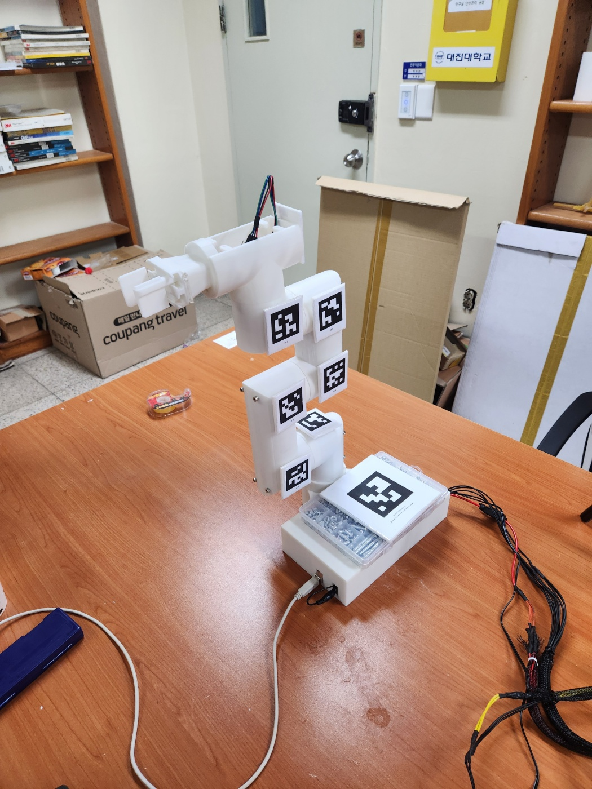
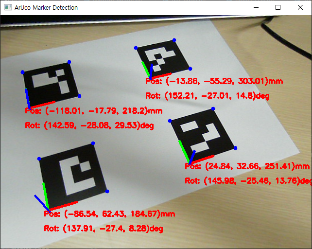

# ArUco 마커 스킴 — 로봇팔

> 로봇팔에 부착하는 ArUco 마커 정의. 인쇄물: `calibration/arm_markers.pdf`
> 생성기: `calibration/make_arm_markers.py` (크기 변경 시 값만 수정 후 재생성)

---

## 1. 사전(dictionary)

| 용도 | 사전 |
|------|------|
| 캘리브레이션 보드(ChArUco) | `DICT_5X5_100` |
| **로봇 마커(베이스·추적)** | **`DICT_6X6_250`** |

→ 서로 다른 사전이라 동시에 써도 **충돌 없음**.

## 2. 마커 목록

| id | 크기 | 역할 | 부착 위치 |
|:--:|:----:|------|-----------|
| **0** | 70mm | **기준 변환 T (단계 ⑤)** — 카메라↔로봇 | **고정 베이스**(안 움직이는 맨 아래) |
| 1 | 40mm | 추적/콜드스타트 | J1 이후 링크 |
| 2 | 40mm | 〃 | J2 링크 |
| 3 | 40mm | 〃 | J3 링크 |
| 4 | 40mm | 〃 | J4 링크 |
| 5 | 40mm | 〃 | J5 링크 |
| 6 | 40mm | 〃 | J6/손목 |
| 7 | 40mm | 〃 | 그리퍼 |
| 8~12 | 40mm | 여분 | 필요 위치 |

> 위 배치는 권장안. 실제로 붙인 id↔위치를 확정하면 이 표를 갱신할 것.

## 3. 부착 가이드

- **베이스(id 0)**: 반드시 **움직이지 않는 부분**에. 이게 로봇 좌표계의 기준. 평평한 면에 크게(70mm) 부착해 포즈 정확도 확보.
- **추적(id 1~)**: 각 링크/그리퍼에 1개씩. **곡면이면 작게 그대로 붙이거나 평평한 관절 하우징**에. 카메라에 보이는 면으로.
- 공통: **구겨지지 않게 평평하게**, 마커 주변 **흰 여백(quiet zone) 유지**(테두리까지 바짝 자르지 말 것), 무광 권장.

## 4. 인쇄

- **반드시 100% 배율**(맞춤설정 100%). 인쇄 후 **50mm 스케일 선**으로 검증.
- id 0은 70mm, id 1~12는 40mm로 출력되어야 함(각 마커 한 변 측정).

## 5. 활용 (다음 단계)

- **단계 ⑤**: id 0 으로 `cv2.aruco.estimatePoseSingleMarkers`(또는 solvePnP) → 카메라→로봇 변환 T 산출 → 저장. 이후 물체 3D를 로봇 좌표로 변환.
- **콜드스타트/추적**: id 1~ 로 각 링크 포즈를 측정해 FK 예측과 비교(운동학 보정), 동작 중 추적.
- 마커 한 변 실측값(mm)을 코드에 정확히 입력해야 거리(포즈)가 맞음.

