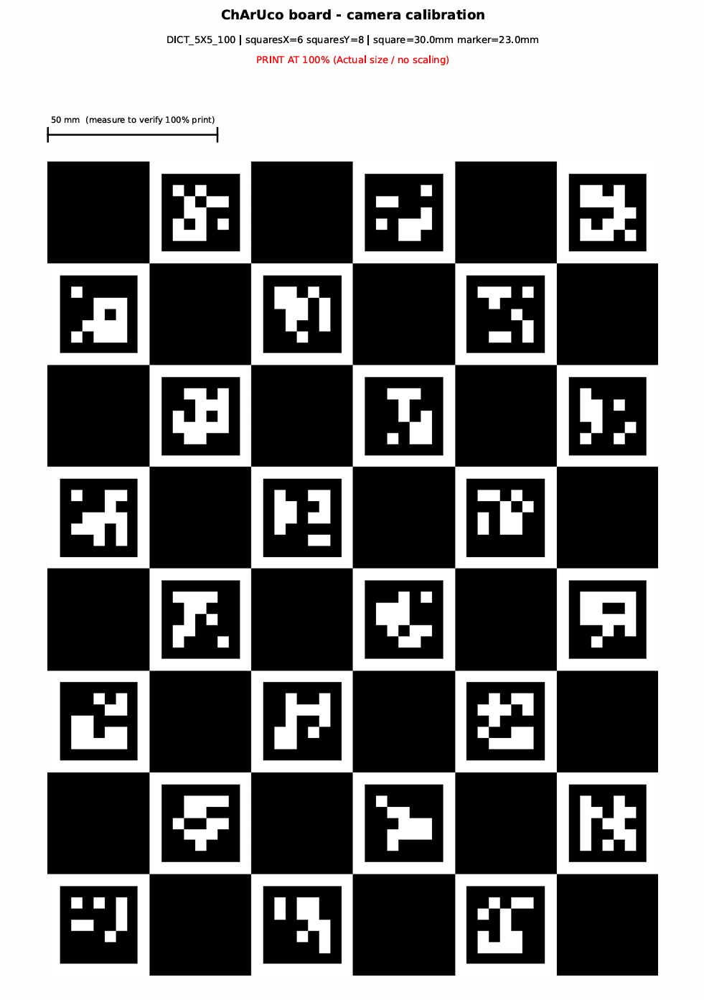
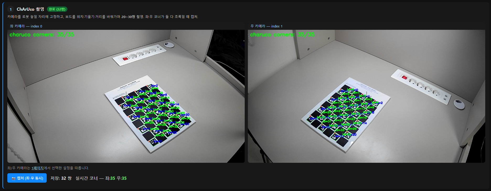

# 3D 좌표 파이프라인 — 2D 픽셀에서 로봇 좌표까지

> 두 카메라의 **2D 픽셀 탐지**를 **로봇 베이스 기준 3D 좌표(mm)** 로 변환하는 전체 단계를 정의한다.
> 이 3D 좌표가 IK(역기구학)의 입력이 되어, 물체를 집기 위한 관절각을 계산한다.
> 수식 세부는 [system_spec §6](../../docs/2_system_spec.md), [laptop README §3](README.md) 참조.

---

## 어떻게 캘리브레이션했나 (방법 요약)

깊이를 알려면 **두 카메라가 같은 점을 본 각도 차이(시차)** 가 필요하고, 그러려면 두 카메라의 **내부 특성(K·왜곡)과 상대 위치(R·T)** 를 먼저 알아야 한다. 이를 알아내는 과정이 캘리브레이션이다.

**왜 ChArUco 보드인가** — 일반 체스보드는 일부가 가리거나 화면 밖으로 나가면 코너 전체를 못 쓴다. **ChArUco**(체스보드 + ArUco 마커 융합)는 각 코너에 **고유 ID**가 박혀 있어, **부분만 보여도** 어떤 코너인지 식별된다 → 다양한 각도/거리 촬영에 강건하고 정확하다.

**실제 절차** (2페이지 위저드, 도구는 OpenCV `cv2.aruco`)
1. **촬영** — `DICT_5X5_100` · **6×8 칸** · 사각 30mm/마커 23mm 보드를 양 카메라로 **20~30쌍** (위치·기울기·거리 다양하게). 화면 가장자리까지 커버.
2. **내부 캘리브레이션** — `CharucoDetector`로 코너 검출 → `cv2.calibrateCamera` → 카메라별 K·왜곡. *(실측 재투영오차 L0.44 / R0.49px)*
3. **스테레오 캘리브레이션** — 양쪽 공통 코너 → `cv2.stereoCalibrate` → R·T·투영행렬 P1·P2. *(0.60px, 베이스라인 588mm)*
4. **검증** — 보드 30mm 칸을 삼각측량으로 복원해 오차 측정. *(0.32mm, 스케일 0.9998 → 통과)*
5. 결과를 `stereo_calib.npz`에 저장해 재사용. 이후 물체의 좌/우 픽셀을 `triangulatePoints`로 3D화.

| ChArUco 보드(인쇄본) | 양 카메라 코너 검출 |
|:---:|:---:|
|  |  |

> 🎬 데모 영상: [로봇팔 3D 인식 과정 — 스테레오 삼각측량](https://drive.google.com/file/d/1MBFXagUDMlq_0g1TG0gAltHQs-gzVrMP/view?usp=sharing)

> 카메라 배치가 바뀌면(상호 위치 변경, USB 재연결로 좌/우 교체 등) **1~3을 다시** 해야 한다. 절차 상세 → [14_setup_procedure.md](14_setup_procedure.md).

---

## 0. 전체 흐름 한눈에

```
[카메라 2대] ──YOLO-World──▶ 2D 픽셀 (u,v) ×2
                                   │
   ① 내부 캘리브레이션 (K, 왜곡)    │  ChArUco 보드
   ② 스테레오 외부 캘리브레이션      │  ChArUco 동시
   ③ 좌우 대응(매칭)               │  같은 물체 짝짓기
                                   ▼
   ④ 삼각측량 ──▶ 3D (X,Y,Z) [카메라 좌표, mm]
                                   │
   ⑤ 로봇 좌표 변환 (T) ──ArUco──▶ 3D [로봇 베이스 좌표, mm]
                                   ▼
                              IK 입력 → 관절각
```

---

## 1. 단계별 명세

### 단계 ⓪ — 2D 픽셀 탐지  ✅ (완료)
- **목적:** 각 카메라에서 물체 위치를 픽셀로 검출.
- **방법:** YOLO-World (`armvision/detector.py`) → bbox 중심 (u, v).
- **산출:** 카메라별 `{class, conf, bbox, center(u,v)}`.
- **한계:** 화면 픽셀일 뿐 깊이/실제 위치 없음. → 이하 단계로 3D화.

### 단계 ① — 카메라 내부 캘리브레이션 (Intrinsics)  ✅
- **목적:** 각 카메라의 **초점거리·주점(K)** 과 **렌즈 왜곡** 산출. 왜곡 보정 없이는 좌표 오차 큼.
- **방법:** **ChArUco 보드**(체스보드 + ArUco 융합 — 일부 가려져도 코너 식별, 부분 검출에 강건)를 다양한 각도·거리로 **20~30쌍** 촬영 → 코너 검출 → 캘리브레이션.
- **OpenCV:** `cv2.aruco.CharucoDetector`(`armvision/charuco.py`) → 코너/ID → `cv2.calibrateCamera` → `K, dist`.
- **산출:** 카메라별 `K`(3×3), `distortion`(5).
- **준비물:** 인쇄된 ChArUco 보드 — `DICT_5X5_100`, **6×8 칸**, 사각 **30mm** / 마커 **23mm**(내부 코너 35개). 생성: `calibration/make_targets.py`.
- **검증:** 재투영 오차 < ~0.5px.

### 단계 ② — 스테레오 외부 캘리브레이션 (Extrinsics)  ✅
- **목적:** **두 카메라의 상대 위치/자세(R, t)** 산출. 삼각측량의 필수 입력.
- **방법:** 두 카메라가 **동시에** 같은 ChArUco 보드를 보는 쌍 여러 장 → 양쪽 공통 코너로 스테레오 캘리브레이션.
- **OpenCV:** `cv2.stereoCalibrate` → `R, T`(좌→우 변환), 이어서 `cv2.stereoRectify`. (`calibration/calibrate_stereo.py` → `stereo_calib.npz`)
- **산출:** `R, T`, 그리고 각 카메라의 **투영행렬 P1, P2**(= K[R|t]).
- **검증:** epipolar 제약 오차 작은지 확인.

### 단계 ③ — 좌우 대응 (Correspondence)  ✅
- **목적:** 좌 카메라의 물체와 우 카메라의 **같은 물체**를 짝짓기 (삼각측량은 같은 점의 좌/우 픽셀이 필요).
- **방법(난이도순):**
  1. 클래스 + 위치 휴리스틱 (같은 class, epipolar 선 근처) — 간단 시작.
  2. **Epipolar 기하** 이용: `cv2.computeCorrespondEpilines` 로 후보 제한.
  3. 외형 특징 매칭(필요 시).
- **산출:** 짝지어진 `(u,v)_left ↔ (u,v)_right` 쌍.
- **메모:** 한쪽에서만 탐지된 물체는 이 단계에서 보완(다른 쪽 epipolar 선 탐색).

### 단계 ④ — 삼각측량 (Triangulation)  ⬜
- **목적:** 좌/우 픽셀 쌍 → **3D 점(카메라 좌표계, mm)**.
- **방법:** 핀홀 모델 `s·[u,v,1]ᵀ = K[R|t][X,Y,Z,1]ᵀ`, 두 카메라로 선형식 구성 → SVD.
- **OpenCV:** `cv2.triangulatePoints(P1, P2, pts_left, pts_right)` → 동차좌표 → 정규화.
  ```python
  pts4d = cv2.triangulatePoints(P1, P2, ptsL, ptsR)
  pts3d = (pts4d[:3] / pts4d[3]).T   # (N,3) mm
  ```
- **산출:** 물체별 3D 좌표 (카메라 좌표계).
- **검증:** 알려진 거리의 물체로 오차 측정.

### 단계 ⑤ — 로봇 좌표 변환 (Frame Transform)  ⬜
- **목적:** 카메라 좌표 → **로봇 베이스 좌표**(IK가 쓰는 기준). 동차변환 `T`.
- **방법:** 로봇 베이스에 **ArUco 마커** 부착 → 카메라로 인식 → 카메라-로봇 변환 산출.
- **OpenCV:** `cv2.aruco`(`estimatePoseSingleMarkers`) → `R, t` → `T=[[R,t],[0,1]]`.
  `X_robot = T · X_camera`.
- **산출:** 물체의 **로봇 베이스 기준 (X,Y,Z) mm**. → IK 입력.
- **저장:** `T`, 캘리브레이션 결과는 재사용을 위해 RAG/파일에 저장.

---

## 2. 단계 → 결과 요약

| 단계 | 입력 | 산출 | OpenCV | 상태 |
|:---:|------|------|--------|:---:|
| ⓪ | 영상 | 2D (u,v) | YOLO-World | ✅ |
| ① | ChArUco | K, 왜곡 | calibrateCamera | ✅ (오차 L0.44/R0.49px) |
| ② | ChArUco(동시) | R,T,P1,P2 | stereoCalibrate | ✅ (오차 0.60px, 베이스 588mm) |
| ③ | 좌·우 탐지 | (u,v) 쌍 | epilines | ✅ (`stereo3d.py` epipolar 매칭) |
| ④ | (u,v) 쌍, P1,P2 | 3D(카메라) | triangulatePoints | ✅ (보드 30mm를 0.32mm 오차로 복원, scale 0.9998) |
| ⑤ | 3D(카메라), ArUco | 3D(로봇) | aruco | ⬜ |

→ 이후: **3D(로봇) → IK(Pieper) → 관절각 → S-curve → PWM → Arduino** (이미 캘리브레이션된 서보 펄스 매핑 사용).

---

## 3. 준비물 (하드웨어)

- **ChArUco 보드** (`DICT_5X5_100`, 6×8, 사각 30mm/마커 23mm) — 단계 ①②③. 평판에 평평히 부착.
- **ArUco 마커** (`DICT_6X6_250`, 로봇 베이스 id0 70mm 등, 크기 mm 측정) — 단계 ⑤⑥, [15_aruco_markers.md](15_aruco_markers.md).
- 카메라 2대는 **고정**(촬영 중 위치 불변) — 캘리브레이션 유효성 유지.

---

## 4. 정밀도 메모

- 3D 프린트 누적 오차로 설계 DH 그대로면 ±10~15mm → 콜드스타트 visual-kinematic 보정으로 ±2mm 목표
  (system_spec §7). 본 파이프라인의 캘리브레이션이 그 토대.
- 단계 ①②의 캘리브레이션 품질이 전체 3D 정확도를 좌우 → ChArUco 보드 촬영을 충분/다양하게.

---

## 5. 구현 순서 제안 (작은 단위)

1. ✅ 단계 ① 한 카메라 내부 캘리브레이션 + 결과 저장.
2. ✅ 두 카메라 각각 ① 완료 → 단계 ② 스테레오.
3. ✅ 단계 ④ 삼각측량을 **고정 ChArUco 코너**로 먼저 검증(물체 매칭 전).
4. ✅ 단계 ③ 물체 대응 붙이기 → 실제 물체 3D.
5. ⬜ 단계 ⑤ ArUco로 로봇 좌표 변환 (베이스 마커 부착 후).
