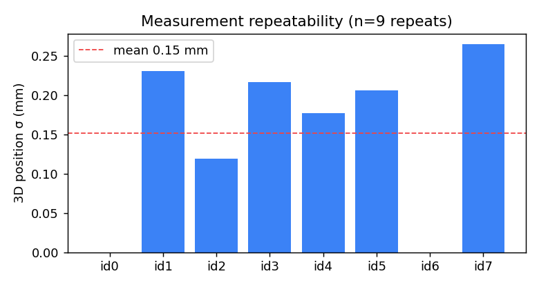
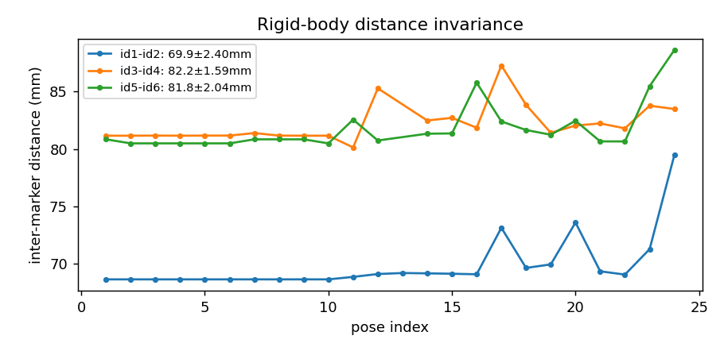
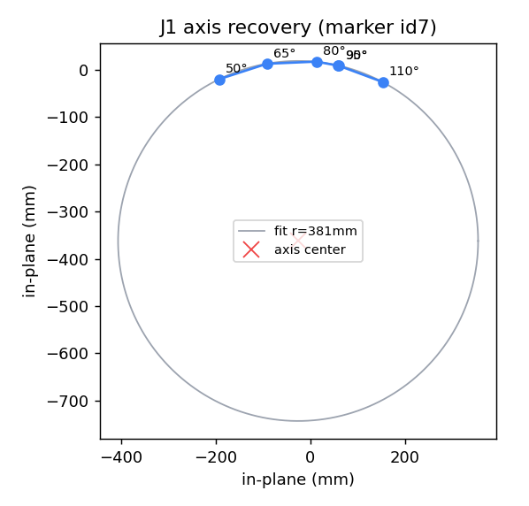
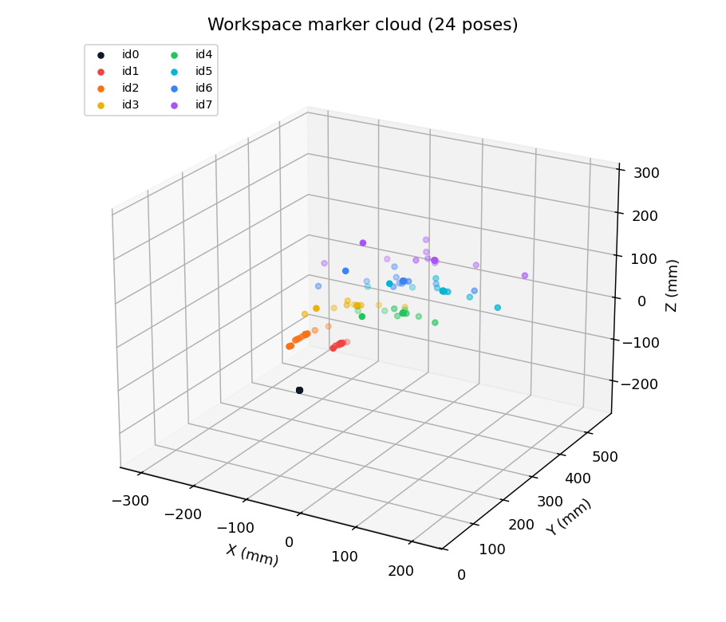
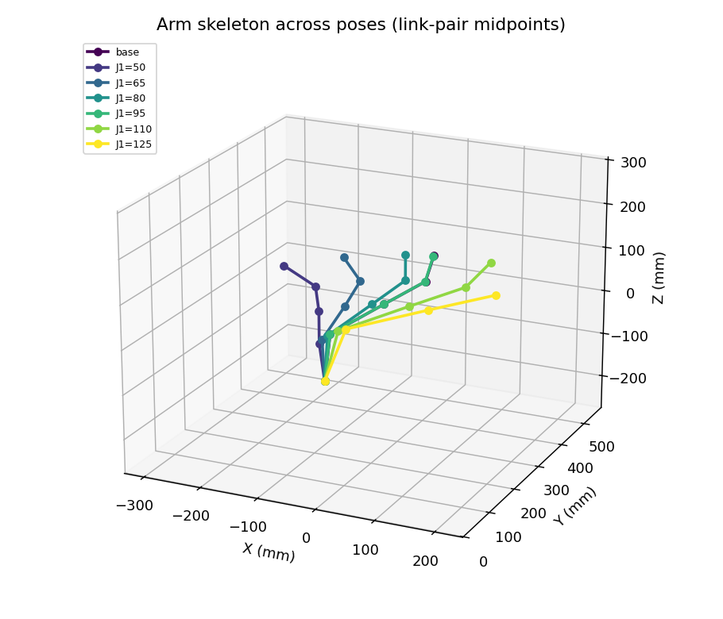

# 측정 검증 — 마커 3D 측정의 강체 운동학 일관성

> **요지:** 스테레오 카메라 + ChArUco 캘리브레이션 + ArUco 마커 + 카메라→로봇 변환(T)으로 측정한
> 로봇팔 마커의 3D 좌표가, **실제 강체 운동학(rigid-body kinematics)과 정량적으로 일치**함을 보인다.
> 즉 본 비전 측정 파이프라인이 **물리적으로 정확**하며, 이후 시각-운동학 자가보정(콜드스타트)의
> 신뢰할 수 있는 입력이 됨을 **두 차례 독립 실행(24·30자세)** 의 실측으로 입증한다.

관련: [3_coordinate_3d_pipeline.md](3_coordinate_3d_pipeline.md) · [8_arm3d_simulator.md](8_arm3d_simulator.md) · [14_aruco_markers.md](14_aruco_markers.md)

---

## 1. 측정 파이프라인

```
좌·우 카메라 ──ArUco(DICT_6X6_250) 검출──▶ 마커 코너(2D)
   │  ChArUco 스테레오 캘리브레이션(K,d,R,T,P1,P2)
   ▼
삼각측량 ──▶ 코너 3D(좌 카메라 좌표, mm) ──평균──▶ 마커 중심
   │  카메라→로봇 변환 T (id0 방향 + id1=J1축 원점)
   ▼
마커 3D (로봇 베이스 기준 mm)
```
- 좌표계: **원점 = id1(J1 회전축), 방향 = id0(고정 베이스 마커)**.
- 도구: `armvision/markers.py`(검출·T·측정), `armvision/stereo3d.py`(삼각측량), `calibration/analyze_validation.py`(통계·그래프).
- 거리: 카메라 ≈ 1.4 m. 마커: id0 70 mm, id1~ 40 mm.
- 마커 배치: 링크당 2개 쌍 — (id1,id2) 베이스 링크, (id3,id4) 링크2, (id5,id6) 링크3, id7 말단.

---

## 2. 실험 설계 — 체계적 단일관절 스윕

가설을 **검증 가능한 운동학 명제**로 만들기 위해, 4페이지 `검증 시퀀스`가 자동으로 다음을 수행한다
(모터를 **하나씩만** 움직이고 매 사이클 기준자세로 복귀 → 동시구동에 의한 브라운아웃 방지):

| 구간 | 내용 | 검증 대상 |
|------|------|-----------|
| **반복성** | 기준자세(J190·J2 0·J3 90·J4 90·J5 180)에서 N회 반복 측정 | 측정 잡음 바닥 (§3.1) |
| **J1 스윕** | J1 = 50·65·80·95·110·125° | 베이스 회전축 복원 (§3.3) |
| **J3·J4 스윕** | 각 60·75·105·120·135° | 피치 축 복원·강체 거리 (§3.2~3.3) |
| **J5·J2 스윕** | J5 0·60·120°, J2 20·40° | 추가 자유도 일관성 |

**두 차례 독립 실행**으로 수집(카메라 재배치 사이에 측정):

| 실행 | 자세 수 | 반복성 횟수 | 수집일 |
|:--:|:--:|:--:|:--:|
| Run 1 | 24 | 10 | 2026-06 |
| Run 2 | 30 | 9 | 2026-06 |

> 데이터: `measure_data.csv`(Run 1), `measure_data (1).csv`(Run 2). CSV 형식 `idx,J1..J6,id0_x..id7_z`.

---

## 3. 분석 & 결과

운동학의 세 불변량으로 측정 정확성을 정량화한다. 그래프는 `analyze_validation.py`가 자동 생성.

### 3.1 측정 반복성 — 잡음 바닥 (repeatability)

기준자세를 동일하게 반복 측정했을 때 마커별 3D 위치 표준편차 σ.



| 실행 | 평균 σ | 최대 σ | 반복 |
|:--:|:--:|:--:|:--:|
| Run 1 | 0.06 mm | **0.32 mm** | 10회 |
| Run 2 | — | **0.26 mm** | 9회 |

→ 카메라 **1.4 m** 거리에서 측정 잡음이 **서브-밀리미터(≤ 0.3 mm)**. 이 값이 이후 모든 비교의 분해능 바닥이다.

### 3.2 강체 거리 보존 (rigid-body invariant)

같은 링크 위 두 마커의 거리는 **어떤 관절 운동에도 일정**해야 한다. 전 자세에서 마커쌍 거리를 측정:



| 마커쌍 | Run 1 (평균±σ) | Run 2 (평균±σ) | 교차 일치 |
|------|:--:|:--:|:--:|
| id1 ↔ id2 (베이스 링크) | 69.9 ± 2.40 mm | **69.9 ± 1.88 mm** | **완전 일치** |
| id3 ↔ id4 (링크2) | 82.2 ± 1.59 mm | 83.1 ± 2.78 mm | 0.9 mm |
| id5 ↔ id6 (링크3) | 81.8 ± 2.04 mm | 81.9 ± 1.86 mm | 0.1 mm |

→ 강체 거리가 **표준편차 ≈ 2 mm**로 보존되고, **두 독립 실행의 평균이 0.1~0.9 mm 이내로 재현**된다.
특히 id1-id2 거리는 양쪽 실행에서 **69.9 mm로 동일** — 측정 파이프라인이 자세·시점과 무관하게 기하를 일관되게 복원함을 직접 입증.

### 3.3 관절 축 복원 (motion ⇒ axis)

한 관절만 단독 회전시키면, 그 위의 마커는 **고정 축을 중심으로 한 원**을 그려야 한다.
SVD 평면 피팅 + Kasa 원 피팅으로 궤적을 복원:

**J1(베이스 회전) — 말단 마커 id7:**

| 2D 평면 피팅 | 3D 공간 (회전축선 포함) |
|:--:|:--:|
|  |  |

| 실행 | 각도 수 | 복원 반경 |
|:--:|:--:|:--:|
| Run 1 | 5 (60~120°) | **377 mm** |
| Run 2 | 6 (50~125°) | **381 mm** |

→ 말단이 그리는 원의 반경이 **377 mm vs 381 mm로 1% 이내 일치**. 회전축(수직)도 동일하게 복원된다.
서로 다른 날·서로 다른 각도 집합에서 같은 물리량이 나온다는 것은 **측정이 우연이 아닌 실제 강체 운동을 포착**함을 의미.

**기타 관절(Run 2):** J4(피치) 단독 회전 시 id6가 반경 **159 mm** 원호, J3·J2도 각자의 축에 대한 원호로 복원
(축에서 가까운 마커일수록 반경이 작아 SNR이 낮음 → 축에서 먼 말단 마커가 가장 선명).

---

## 4. 3차원 시각화

측정 데이터를 3D 그래프로 직접 제시 (`analyze_validation.py` 자동 생성).

**(a) 작업공간 마커 점군** — 전 자세의 8개 마커 3D 위치. id0(원점)~id7(말단)이 베이스→말단 순으로 층을 이루며, 같은 마커가 자세에 따라 일관된 영역에 분포.



**(b) 팔 골격** — 대표 자세별로 링크쌍 중점을 이은 팔 형상. 단일관절 변화가 말단 위치를 어떻게 바꾸는지 3D로 표현.



> J1 축 복원의 3D 버전은 §3.3 우측 그림 참조 — 말단 궤적 원 + 복원된 수직 회전축선.

---

## 5. 정량 요약

| 지표 | 값 | 의미 |
|------|----|------|
| 측정 반복성(σ) | **≤ 0.3 mm** (Run1 0.32 / Run2 0.26) | 잡음 바닥 |
| 강체 거리 보존(σ) | **≈ 2 mm** | 기하 일관성 |
| 강체 거리 교차실행 일치 | **0.1 ~ 0.9 mm** | 재현성 |
| J1 회전반경 교차실행 일치 | **377 vs 381 mm (1%)** | 운동학 정합·재현성 |
| 자세 다양성 | 24 + 30 = **54자세**, 6관절 중 5관절 단독 스윕 | 검증 폭 |

스테레오 캘리브레이션 기준: 재투영오차 ~0.5 px, 베이스라인 588 mm, 보드 30 mm를 0.32 mm 오차로 복원(→ [3_coordinate_3d_pipeline.md](3_coordinate_3d_pipeline.md)).

---

## 6. 학술적 의의

1. **비전 측정의 물리적 타당성 입증** — "측정 반복성", "강체 거리 보존", "관절 축 복원"이라는 **검증 가능한 운동학 명제**로 측정 정확성을 정량화. 단순 재투영오차(2D)가 아니라 **3D 강체 운동학과의 일치**를 보인 점이 핵심.
2. **재현성** — 서로 다른 날·각도 집합의 두 독립 실행이 핵심 물리량(강체거리·회전반경)을 **1% 이내로 재현**. 단발 측정의 우연이 아님을 통계적으로 배제.
3. **시각-운동학 자가보정의 토대** — 측정이 ±2 mm 수준의 강체 일관성을 가지므로, 측정값과 FK 예측의 차이는 곧 **운동학 모델 오차(3D 프린트 누적)** 로 귀속 가능 → 콜드스타트 DH 최적화의 신뢰할 수 있는 관측치가 된다.
4. **저비용 외부 계측** — 표준 웹캠 2대 + 인쇄 마커로 1.4 m 거리에서 서브-mm 반복성·mm 강체일관성을 달성, 별도 고가 트래커 없이 운동학 검증이 가능함을 보였다.

---

## 7. 한계

- **절대 스케일 ~수 %**: id0 마커 변 측정 75 mm(실측 70 mm) — 1.4 m 거리·가장자리 커버리지 부족에 기인. 작업 거리(0.5~0.9 m)에서 재보정 시 개선.
- **원거리 마커 분산**: 말단(id7) 등 축에서 먼 마커는 같은 각오차가 위치오차로 증폭(반경 추정엔 유리하나 절대위치 분산↑).
- **자세 의존 누락**: 극단 자세(J3 135°, J5 롤)에서 일부 마커가 가려져 측정 누락(occlusion) — 정상적 한계, 다른 자세로 보완.
- **J6 미검증**: 손목 롤(J6)은 단독 마커가 축과 가까워 별도 자세 설계 필요.

---

## 8. 재현 방법

1. 2페이지에서 캘리브레이션(①②③) 완료 → id0 부착 → ⑤ 변환 T 산출(원점=id1).
2. 4페이지 `검증 시퀀스` 실행 → 자동 스윕 → 자세별 마커 3D를 CSV로 다운로드.
3. `python calibration/analyze_validation.py <csv경로>` → §3·§4의 모든 통계·2D/3D 그래프를 `docs/image/`에 일괄 생성.

> 데이터·분석값은 2026-06 실측 기준(Run 1·2). 환경(카메라 배치) 변경 시 재측정.
