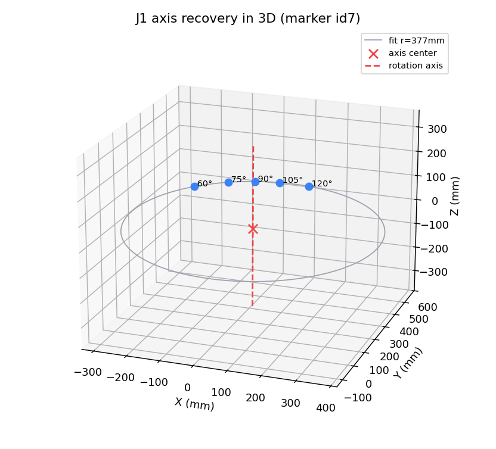

# 콜드스타트 절차 — 비전-운동학 자가보정

> **목적:** 실물 로봇팔에 전원을 막 켰을 때(cold start), CAD 도면 없이
> **`{명령한 관절각/펄스, 카메라로 측정한 마커 3D}`** 만으로 **실제 운동학**(관절 축의 위치·방향,
> 명령↔실제 각도 관계)을 복원한다. 3D 프린트 누적오차 + 서보 비선형으로 실물은 CAD와 다르므로,
> 이를 측정으로 잡아내야 디지털 트윈(시뮬)이 실물과 일치한다.

관련: [4_measurement_validation.md](4_measurement_validation.md)(측정 신뢰성) · [6_digital_twin_safety.md](6_digital_twin_safety.md)(시뮬 안전모델) · [3_coordinate_3d_pipeline.md](3_coordinate_3d_pipeline.md)(3D 측정)

---

## 1. 계층 역할 — 보정은 어디서 하나

3계층에서 **콜드스타트 보정은 노트북(제어 허브)의 책임**이다. AI 서버는 언어만 담당하며, 원시 측정·펄스를 받아 보정하지 않는다.

```
AI 서버   : 자연어 → 의도/명령(DSL)               ["무엇을" 할지]
   ↓ gRPC
노트북    : 비전·운동학·콜드스타트 보정·안전(충돌모델)·펄스생성   ["어떻게" 할지]  ← 보정 여기
   ↓ Serial
Arduino   : 펄스 실행
```

**보정 데이터 흐름** (둘 다 노트북으로 모여 보정된 안전 모델을 만든다):
```
[실물 구동 + 카메라 측정 + 펄스 기록]  ──┐
                                          ├─▶ 노트북: 콜드스타트 → 정확한 FK + 안전 검증층
[시뮬 결과(디지털트윈·충돌모델)]      ──┘
```
→ AI 명령은 이 **안전 검증층을 통과해야** 실물로 간다.

---

## 2. 절차 (6단계)

| 단계 | 내용 | 도구/산출 |
|:--:|------|------|
| 1 | **스테레오 캘리브레이션**(ChArUco) + **카메라→로봇 변환 T**(원점 = id1 = J1축) | 2페이지 ①~⑤ |
| 2 | **ArUco 마커 부착**: id0 베이스, id1~7 각 링크 | — |
| 3 | **데이터 수집**: 4페이지 `검증 시퀀스` — **한 관절씩 단독**으로 각도를 바꾸며 매 자세에서 8개 마커 3D를 스테레오 측정 → CSV `{idx, J1~J6, id0_x…id7_z}` | `calibration/validation_data/run{1,2}_*.csv` |
| 4 | **관절 축 복원**: 단독 회전 시 말단 마커가 그리는 **원을 피팅**(SVD 평면 + Kasa 원) → 회전축(방향 ω·축상의 점 q) + **명령↔실제 각도 보정계수 k** | `calibration/coldstart.py` |
| 5 | **PoE 순기구학(FK) 구성·검증**: 복원 축으로 FK를 만들어 측정 자세를 예측 → **잔차 = sim-real gap** | `coldstart.py` |
| 6 | **결과 사용**: gap을 디지털 트윈 **안전 마진**으로 연동 | [6_digital_twin_safety.md §5](6_digital_twin_safety.md) |

> **펄스를 기록하는 이유:** 각도는 서보 보정이 한 겹 얹힌 추상이고, **펄스가 "진짜 명령"** 이다.
> `{펄스, 측정 3D}`를 직접 보정하면 "명령 75°가 실제 68°(k=0.913)" 같은 비선형을 펄스 단위로 잡는다.

---

## 3. 이론 — PoE(Product of Exponentials)

각 관절을 단독 회전시키면 그 위(distal)의 마커는 **고정 축에 대한 원**을 그린다. 원을 피팅해 **스크류 축** $S_i=(\omega_i, q_i)$ 와 보정계수 $k_i$ 를 얻으면, 임의 자세의 마커 위치는

$$p(\theta) = e^{[S_1]\theta_1} e^{[S_2]\theta_2} \cdots e^{[S_n]\theta_n}\, p_{home}, \qquad \theta_i = k_i(\text{cmd}_i - \text{home}_i)$$

로 예측된다(공간형 PoE). DH 파라미터화보다 **측정한 축을 직접 쓰므로** 본 데이터에 자연스럽다.

| 산출 | 의미 |
|------|------|
| $\omega_i$ (원 평면의 법선) | 관절 회전축 방향 |
| $q_i$ (원 중심) | 축이 지나는 점 |
| $k_i$ (관측 회전 / 명령 각도) | **명령↔실제 보정계수**(서보 비선형·기어비 흡수) |

J1 축 복원 예 (말단 마커가 그리는 원 + 복원된 수직 회전축):



---

## 4. 현재 결과 (정직하게 — 부분 보정)

`run2_30pose.csv` 기준:

| 관절 | 결과 | 비고 |
|:--:|------|------|
| **J1** | ✅ 복원 (반경 380mm, **k=0.913**, 각잔차 2.66°) | 명령 75°→실제 68°(서보 ~9% 과명령) |
| **J4** | ✅ 양호 (반경 149mm, 1.73°) | |
| J2·J3 | ❌ 불량 | 마커가 피치축에 근접·가림 → 원이 작아 노이즈 |
| J5·J6 | ❌ 미복원 | 말단 마커 id7 가림 |

| 핵심 산출 | 값 |
|------|-----|
| 비전 측정 잡음 바닥 | σ ≤ 0.3 mm (완벽) |
| **FK 잔차 = sim-real gap** | **평균 12.4 mm · 최악 30.8 mm** |
| 원인 | 서보 비선형 ~3°가 긴 레버에서 cm급 증폭 |

> **즉, 현재 콜드스타트는 "완전한 6축 운동학 모델"이 아니라 "sim-real gap 크기 + J1 보정계수를 측정한 부분 보정"** 이다.
> gap(30mm)을 안전 마진으로 쓰기엔 충분했다.

---

## 5. 미완 + 완성 로드맵

**원인:** 마커가 피치축(J2·J3)에 너무 가깝고, 손목(J5·J6) 회전 시 말단 마커가 가려진다.

**완성하려면:**
1. **데이터 보강** — 마커를 축에서 멀리 재배치, 또는 **팔이 아래를 향하는 전용 스윕**(말단 마커가 보이게)으로 J2·J3·J5·J6 수집. 각도당 반복 측정.
2. **번들 최적화** — 독립 원피팅을 초기값으로, 모든 축을 동시에 맞추는 **LM 최적화**(scipy)로 체인 누적오차 최소화.
3. **펄스 기준 보정** — `{펄스, 측정 3D}`로 펄스→실제자세 직접 매핑(서보 비선형 정밀 보정).

---

## 6. 재현

```
1) 2페이지 ①~⑤  (스테레오 보정 + 변환 T, 원점=id1)
2) 4페이지 제어 → 검증 시퀀스  → run_*.csv 다운로드
3) python calibration/coldstart.py <csv> [그리퍼길이mm]
     → 관절별 축·k, FK 잔차(sim-real gap), 바닥/그리퍼 도달 분석 출력
```

> 데이터·수치는 2026-06 실측 기준(run1 24자세·run2 30자세). 환경(카메라·조립) 변경 시 재측정.
