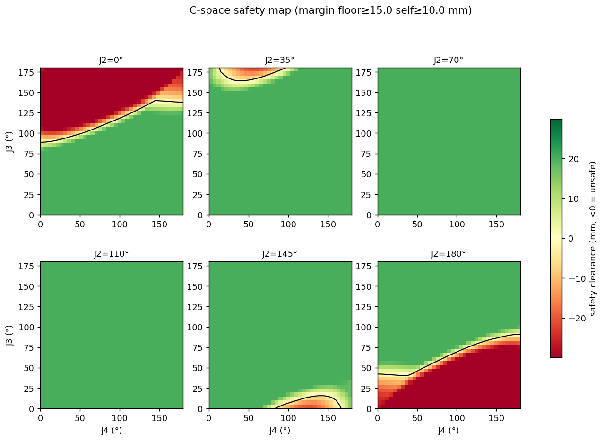
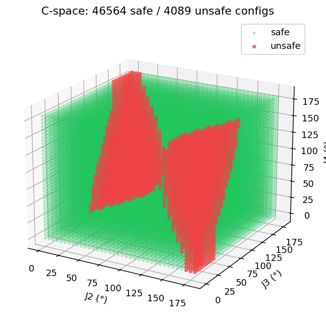
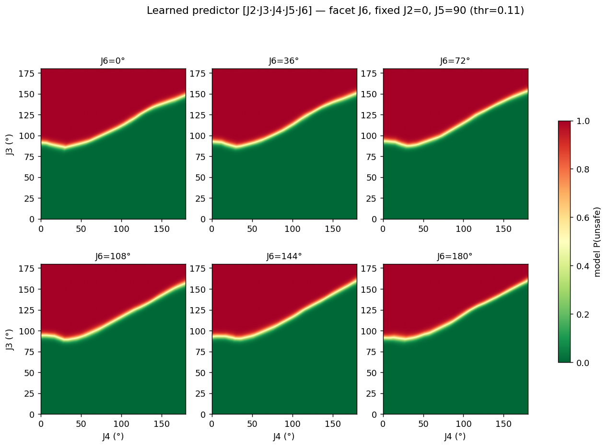
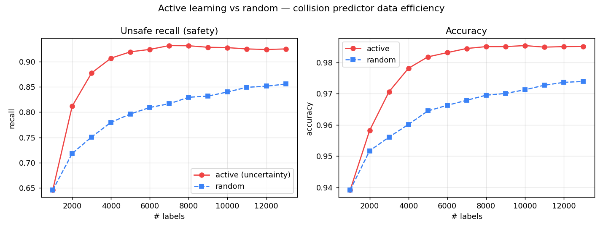
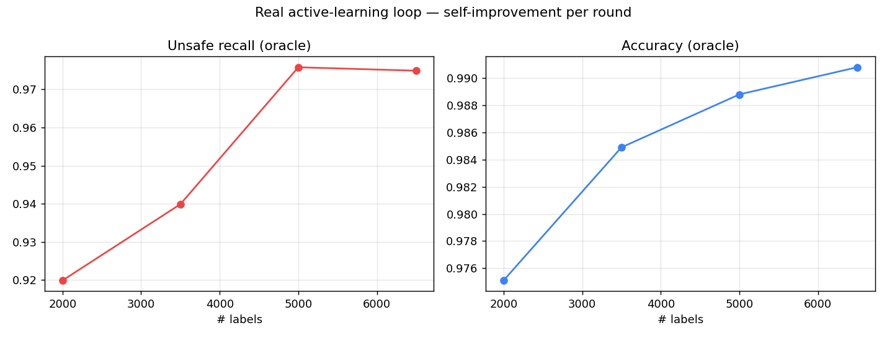

# 디지털 트윈 안전 검증 + 자가학습 — 비전 보정 시뮬레이션을 통한 충돌 안전 모델

> **요지:** STL 3D 시뮬레이터를 **디지털 트윈**으로 삼아, 비전(콜드스타트)으로 실물에 보정하고,
> 시뮬에서 **스스로 충돌 데이터를 생성·학습**하여, AI 명령을 실물 실행 전에 검증하는 안전층을 만든다.
> 핵심 기여는 ① 저비용 웹캠+시뮬로 sim-to-real 보정 루프를 닫고,
> ② **불확실 자세 기반 능동학습으로 모델이 스스로 약점을 찾아 성장**시키며,
> ③ 안전 마진을 **측정된 sim-real gap**에 연동해 "시뮬 안전 ⇒ 실물 안전"을 정량 보증한 것이다.

관련: [4_measurement_validation.md](4_measurement_validation.md) · [8_arm3d_simulator.md](8_arm3d_simulator.md) · [3_coordinate_3d_pipeline.md](3_coordinate_3d_pipeline.md)

---

## 1. 개념 — 하나의 디지털 트윈으로 묶이는 조각들

"시뮬레이션으로 미리 학습해 안전 확보"와 "캘리브레이션/콜드스타트"는 별개가 아니라 **하나의 디지털 트윈**이다.

```
   3D 시뮬(CAD 이상 모델)  ──예측──▶  "이 자세는 위험"
          ▲                              │  믿어도 되려면?
          │ 보정(콜드스타트)              ▼
   비전 측정(실물 관측) ◀── 실물이 실제로 그렇게 움직이는가
```

본 연구가 구현한 전체 파이프라인:

```
디지털트윈(STL 시뮬) → 비전 콜드스타트 보정(sim-real gap 측정)
   → C-space 충돌지도(L0, 자가생성) → 충돌예측 신경망(L1)
   → 능동학습(불확실 자세 자가선별로 약점 보강) → AI 명령 검증층
```

각 단계는 확립된 문헌에 1:1로 대응한다 — 디지털 트윈, 운동학 캘리브레이션, **구성공간(Configuration Space, Lozano-Pérez 1983)**, 학습 기반 충돌검사(learned collision checking), 능동학습(active learning). 본 연구의 새로움은 이 전체 루프를 **표준 웹캠 2대 + 인쇄 마커 + STL 시뮬**이라는 저비용 구성으로 재현하고, 그 산출물을 **LLM 명령의 안전 검증층**으로 사용한 데 있다.

---

## 2. 디지털 트윈 — 시뮬 내장 충돌 감지

4페이지 STL 시뮬레이터(`arm3d.html`, Three.js)에 충돌 감지를 내장했다. 모든 부품은 STL 정점을 가지므로, **정점을 점군으로 활용**한다.

### 2.1 바닥 충돌
- 각 부품 STL 정점을 ~400점 다운샘플 → 매 프레임 월드 좌표로 변환 → **최저 y가 바닥평면(격자, y=0) 대비 여유**.
- 받침대(운동학 루트)는 설계상 바닥에 닿으므로 제외, **움직이는 링크만** 검사.
- 제어 모드에서 실시간 HUD(여유 mm·안전/위험/충돌) + 충돌점 마커.

### 2.2 자기 충돌 (그리퍼 ↔ 팔 본체)
- **손(그리퍼) 자동 식별:** 직렬 팔 체인이 처음 갈라지는 부품(`gripper base`)부터 모든 자손을 한 덩어리로 묶는다.
- 손의 점들을 **비인접 링크의 로컬 OBB(bounding box)에 투영**해 부호거리(음수=침투) 계산.
- 손 자신·장착 링크(손목)·미리깅 정적 부품은 제외 → 구조적 오탐 방지.

> 이 충돌 코어(`_collideOnce`)는 실시간 HUD·일괄 스윕·능동학습 라벨링이 **모두 공유**하여 일관성을 보장한다.

---

## 3. C-space 충돌 지도 (L0 — 자가생성 데이터)

관절 공간을 쓸어 각 자세의 충돌을 라벨링하면 **구성공간(C-space) 장애물 지도**가 된다. 모든 모션 플래닝의 기반 개념이다.

### 3.1 어떤 관절을 쓸 것인가 — 축 분석
관절 축을 분석해 충돌과 무관한 관절을 가려냈다:

| 관절 | 축 방향 | 충돌 영향 | 처리 |
|:--:|:--:|------|------|
| J1 | `[0,−1,0]` 수직 | 높이·부품거리 **불변** | **제외**(수직 yaw → 충돌 불변, 스윕 낭비) |
| J2·J3·J4 | 수평 피치 | 바닥 주 결정 | 격자+랜덤 |
| J5 | `[−0.11,−0.99,0]` 준수직 | 손 수평 스윙 → **자기충돌(주효)** | 랜덤 |
| J6 | `[−1,0,0]` 수평 피치 | 그리퍼를 바닥으로(방향상) — 짧아 영향 작음 | 랜덤 |

> **실측 특징 중요도(RandomForest, 100k):** J2 **41.6%** · J3 **32.0%** · J4 13.9% · J5 **10.0%** · J6 **2.6%**.
> 바닥은 J2·J3가 지배. **손목 중 J5가 J6보다 영향이 크다** — 극단 J5(0·180°)에서 손이 팔 본체로 스윙해 자기충돌(J5=60~120° 중립에선 자기충돌 ≈0). J6의 '그리퍼를 바닥으로' 효과는 방향상 맞으나 그리퍼가 짧아 통계적 비중은 작다.

> **발견:** 초기 스윕은 손목(J5·J6)을 고정해 손목발(發) 충돌을 빠뜨렸다. 둘을 넣자 충돌률이 6.5%→10.0%로 오르고, **손목 회전으로 그리퍼가 팔 본체(base·elbow)에 부딪히는 자기충돌(1.7%)** 이 처음 드러났다. (자기충돌을 주도한 건 J6보다 **J5**였다.)

### 3.2 격자 vs 랜덤
- **격자(J2·J3·J4, 5°):** 50,653 조합. 2D 히트맵 시각화용.
- **랜덤(J2~J6, Monte Carlo):** 5차원은 격자 폭발(37⁵≈6,900만)이라 **랜덤 샘플링이 정석**. 100,000 샘플.



> 🎬 데모 영상 — 디지털트윈 C-space 충돌 검증: [①](https://drive.google.com/file/d/1vYuo53dGs2aWkysy1HClAFdfzunhA5IU/view?usp=sharing) · [②](https://drive.google.com/file/d/1E0i8ZytOhljyalwJxXthOAcU_MwYzIW0/view?usp=sharing)

J2별 패널: 초록=안전, 빨강=위험, 검은선=충돌경계. J2≈70~110°(팔이 수직)에선 전 영역 안전(바닥 무관), J2≈0·180°(앞/뒤로 접음)+극단 J3에서 바닥 충돌.



(J2,J3,J4) 공간에서 위험 영역(빨강)이 **두 날개**로 분리되는 전형적 C-space 장애물 형상.

---

## 4. 충돌예측 신경망 (L1 — 자가학습 모델)

자가생성 데이터로 관절각(J2~J6) → 안전/위험을 예측하는 신경망(MLP 64×64)을 학습한다. 목적은 **AI가 메시 충돌검사 없이 마이크로초 만에 자세 안전성을 질의**하는 검증층.

| 지표 | 값 |
|------|-----|
| 학습 데이터 | 100,000 자세 (시뮬 자가생성, 사람 라벨 0) |
| 정확도 | 98.97% |
| 위험 재현율(임계 0.5) | 97.54% |
| **안전 임계(0.14) 재현율** | **99.53%** (미탐 17/3579) |
| 추론 속도 | **0.8 µs/질의** |

안전이 핵심이므로(위험을 놓치면 로봇 파손) 확률 임계값을 낮춰 **위험 재현율을 최대화**(미탐 최소화, 오경보 감수)한다.



J6별 패널: 색=모델 예측 P(위험). **J6(그리퍼 피치)가 커질수록 위험 영역이 확장** — 그리퍼가 아래로 내려가 바닥에 닿는 효과를 모델이 학습했다.

---

## 5. sim-real gap 마진 — 시뮬과 실물을 잇는 키스톤 (#4)

C-space 지도는 **이상적 CAD 기하 + 명령 각도**로 계산된다. 실물은 (a) 서보 비선형 ~3°, (b) 3D 프린트 누적오차로 어긋난다. 따라서 "시뮬 안전 ⇒ 실물 안전"이 성립하려면:

$$\text{안전(실물)} \iff \text{시뮬 여유} > \delta\;(\text{측정된 sim-real gap})$$

이 δ를 **콜드스타트(비전-운동학 자가보정)로 실측**했다 → [4_measurement_validation.md](4_measurement_validation.md), `coldstart.py`:

| 측정 | 값 |
|------|-----|
| 비전 측정 잡음 바닥 | σ ≤ 0.3 mm (완벽) |
| **콜드스타트 FK 잔차(sim-real gap)** | **평균 12.4 mm · 최악 30.8 mm** |
| 원인 | 서보 각도 비선형 ~3° → 긴 레버에서 cm급 |

→ **바닥 마진 = 30 mm**(외부 평면, 최악 gap 전부), **자기 마진 = 15 mm**(상대 기하라 오차 일부 상쇄 → 절반). 이 마진을 반영하면 위험률 14.3%.

**잔존 위험 정량화:** 100k 모델에서 안전 임계로 놓친 위험 17개의 실제 침투깊이는 **중앙값 1.9 mm·최악 10.4 mm** → 전부 30 mm 보정 마진 *안*. 즉 **모델이 위험을 놓쳐도 실물 충돌 경계엔 여전히 여유**가 있어 안전이 보증된다. (데이터를 40k→100k로 늘리니 최악 미탐이 16.9→10.4 mm로 줄어, 데이터 증가가 안전 보증을 직접 강화함을 확인.)

---

## 6. 능동학습 — 모델이 스스로 약점을 찾아 성장 ★

본 연구의 자가학습 서사의 핵심이다. **균일 랜덤 대신, 모델이 가장 헷갈려하는 자세(결정경계, P(위험)≈0.5)를 골라 그것만 라벨링**한다.

### 6.1 데이터 효율 (능동 vs 랜덤)
기존 100k를 오라클 풀로 한 공정 비교(RandomForest, 3시드 평균):



→ **능동이 랜덤의 최종 성능(13,000 라벨)에 단 3,000 라벨에서 도달 → 라벨 77% 절약.** 전 구간 능동이 랜덤을 7~12%p 앞선다.

### 6.2 실운용 자가학습 루프 (★ 핵심)
데모(풀 내부)를 넘어, **풀 밖의 새 자세를 실제 시뮬로 라벨링**하는 진짜 루프를 구현했다:

```
Python: 모델이 불확실(P≈0.5)한 자세 N개 선별 → cspace_query.csv
   ↓
시뮬(4p 🏷 질의 라벨링): 각 자세 충돌검사 → cspace_labeled.csv
   ↓
Python: 누적·재학습·오라클 평가 → 다음 질의 …  (반복)
```

소량 시드(2000, 랜덤)에서 시작해 라운드마다 모델이 스스로 약점을 제안·보강:

| 라운드 | 누적 라벨 | 정확도 | 위험 재현율 | 비고 |
|:--:|:--:|:--:|:--:|------|
| 1 (시드, 랜덤) | 2,000 | 97.51% | 91.99% | 출발점 |
| 2 (능동) | 3,500 | 98.49% | 93.99% | |
| 3 (능동) | 5,000 | 98.88% | **97.58%** | **균일 100k 성능 도달** |
| 4 (능동) | 6,500 | 99.08% | 97.49% | 수렴 |



> **🎯 핵심 결과: 5,000 라벨(전체 데이터의 5%)로 균일 100k 모델과 동일한 재현율(97.5%)에 도달.**
> 추가된 자세의 위험 비율이 15%→35%로 상승 = **능동학습이 실제로 위험/안전 경계에 데이터를 집중**시키고 있다는 증거. "로봇이 시뮬에서 스스로 헷갈리는 자세를 제안하고, 디지털 트윈이 충돌 여부로 답하며, 모델이 약점을 보강하며 성장"하는 자가학습 루프가 작동함을 실측으로 증명했다.

### 6.3 자가학습의 정직한 위치 (사다리)
| 단계 | 내용 | 본 연구 |
|:--:|------|:--:|
| L0 | 전수/랜덤 열거 → C-space 지도 | ✓ |
| L1 | 자가생성 데이터로 학습된 충돌예측 모델 | ✓ |
| **능동** | 모델이 라벨 대상을 스스로 선별(자기개선) | ✓ |
| L2 | 보정된 트윈에서 RL 모션 정책 | 향후 |

본 연구는 **시스템 식별 + 능동학습**으로, RL(L2)은 아니나 "자가생성 데이터 → 학습 → 자기개선"이 모두 *과장 없이 사실*이다. 보정된 디지털 트윈을 이미 갖췄으므로 L2 RL의 전제조건은 충족되어 있다.

---

## 7. AI 명령 검증층 — 할루시네이션 처리

학습된 모델의 가장 강력한 역할은 AI의 두뇌가 아니라 **안전 검증층**이다:

```
사용자 명령 → [LLM이 동작 생성] → [충돌예측 모델 0.8µs 검증] → 통과만 실물로
                  (할루시네이션 가능)        (결정론적·측정근거 마진)
```

LLM이 팔을 부수는 자세를 제안해도, 시뮬에서 학습한 검증층이 실물 실행 전에 잡아낸다. 이것이 자연어 제어의 **할루시네이션 처리**다.

---

## 8. 정량 요약

| 영역 | 지표 | 값 |
|------|------|-----|
| 측정 | 비전 잡음 바닥 | σ ≤ 0.3 mm |
| 보정 | sim-real gap(콜드스타트 FK 잔차) | 평균 12.4·최악 30.8 mm |
| L0 | C-space 데이터 | 격자 50,653 + 랜덤 100,000 |
| L1 | 5D 모델 정확도 / 안전재현율 | 98.97% / 99.53% |
| L1 | 추론 속도 | 0.8 µs/질의 |
| L1 | 잔존 위험(놓친 위험 최악 침투) | 10.4 mm (< 마진 30 mm) |
| 능동 | 라벨 효율(데모) | 77% 절약 |
| 능동 | 실운용 수렴 | 5,000 라벨(5%)로 100k 성능 |

---

## 9. 학술적 의의

1. **검증 가능한 안전 모델** — 단순 2D 재투영오차가 아니라, **3D 강체 운동학으로 보정된 디지털 트윈**에서 충돌 안전을 학습. 마진이 *측정된* sim-real gap에 묶여 "시뮬 안전 ⇒ 실물 안전"을 정량 보증.
2. **자가학습 실증** — 시뮬이 스스로 데이터를 생성하고(L0), 모델이 학습하며(L1), **불확실 자세를 자기선별해 약점을 보강(능동)** — 전체 루프를 실운용으로 닫았다.
3. **저비용 재현** — 웹캠 2대 + 인쇄 마커 + STL 시뮬로 디지털 트윈 보정 + C-space + 학습 안전층을 구성, 고가 트래커·물리엔진 없이 sim-to-real 안전 검증을 시연.

---

## 10. 한계 및 향후

- **미리깅 정적 부품:** 링크의 `.t`(윗면) 반쪽이 리깅되지 않아 자기충돌 대상에서 제외. 고정 결합 시 충돌 검사 포함 가능.
- **콜드스타트 피치축:** J2·J3는 마커가 피치축에 근접·가림으로 축 복원 불량, J5·J6은 말단 마커 가림으로 미복원. 아래방향 전용 스윕으로 보강 필요.
- **라벨 비용:** 시뮬 라벨이 싸서 능동학습의 실익(정확도)보다 아키텍처 시연 가치가 큼. 라벨이 비싼 실물 검증으로 확장 시 능동학습의 실용 가치 부각.
- **향후:** ① J2/J3 콜드스타트 보강으로 자세별 정밀 마진 ② L2 RL 모션 정책 ③ AI 서버 자연어 파이프라인에 검증층 연결.

---

## 11. 재현 방법

| 단계 | 명령 / 동작 |
|------|------|
| C-space 격자 | 4p 제어 → `🗺 격자(J2·J3·J4)` → `cspace_grid.csv` → `python calibration/cspace_analysis.py <csv>` |
| C-space 랜덤(5D) | `🎲 랜덤(J2~J6)` → `cspace_rand.csv` → `python calibration/cspace_learn.py <csv>` |
| 능동학습 데모 | `python calibration/cspace_active.py <csv>` |
| 실운용 능동 루프 | `cspace_active_loop.py init/query/merge/plot` ↔ 4p `🏷 질의 라벨링` (§6.2) |

> 데이터·수치는 2026-06 실측 기준. 환경(카메라·조립) 변경 시 재측정.
