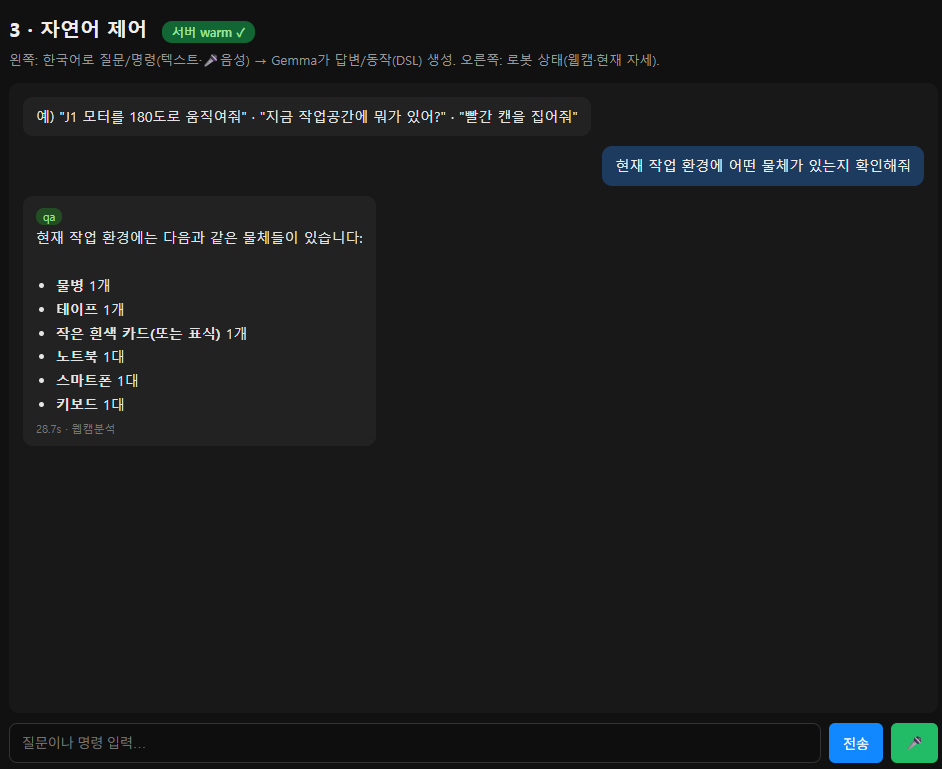

# AI 서버 연동 — 3페이지 자연어 제어 (노트북 측)

> **노트북이 AI 서버(EdgeXpert)와 gRPC로 연결**해, 음성/텍스트 명령 → DSL을 받아 표시·실행하는 구현.
> 3계층 중 노트북(Layer 2, "어떻게") ↔ AI 서버(Layer 3, "무엇을")의 다리.
> AI 서버 측: [../../ai_server/docs/1_implementation.md](../../ai_server/docs/1_implementation.md) · 인터페이스: [3_grpc_interface.md](../../docs/3_grpc_interface.md) · [5_dsl_spec.md](../../docs/5_dsl_spec.md)

---

## 1. 전체 흐름

```
[3페이지 자연어 제어]
  ⌨️텍스트 / 🎤음성(MediaRecorder) ─┐
                                     ├─ POST /ai/plan ─▶ ai_client.py(gRPC) ─▶ EdgeXpert warm 서버
  📷현재 웹캠 2장 + YOLO 탐지 ───────┘                                          (STT→라우터→VLM/DSL→검증)
                                                                                      │
  ◀──────────── intent · 답변(마크다운) · DSL(검증) ───────────────────────────────────┘
                                     │
                 (command·set_joint) ▶ 수동 실행 버튼 → /arm/exec_joint → 실물(안전 램프)
```



---

## 2. gRPC 클라이언트 (`armvision/ai_client.py`)

- 서버: `100.64.39.90:50051`(Tailscale, env `AI_SERVER`로 변경). 스텁 `robot_arm_pb2{,_grpc}.py`(proto 생성).
- `health()` → warm 여부. `plan(text, audio, img_left, img_right, detections_json)` → `{intent, transcript, answer, dsl_json, valid, errors, elapsed_s}`.
- LLM은 EdgeXpert에만 — 노트북은 클라이언트일 뿐(grpcio만 필요).

## 3. Django 엔드포인트 (`views.py` / `urls.py`)

| 엔드포인트 | 역할 |
|------|------|
| `GET /ai/health/` | AI 서버 warm 상태 |
| `POST /ai/plan/` | `{text\|audio_b64, vision}` → **현재 좌/우 웹캠(JPEG)+YOLO 탐지 자동 첨부** → ai_client.plan → 결과 |
| `POST /arm/exec_joint/` | `{joint, angle, from}` → 관절→채널·각도→펄스, **2°씩 램프(브라운아웃 방지)**, 실물 연결 확인 |

> 펄스 매핑: `_JOINT_CH`(J1=ch0…J6=ch5) + `_SERVO_CAL`(채널별 us0/us180, 실측) + `us = us0 + ((180−angle)/180)*(us180−us0)`(시뮬↔실물 미러).

## 4. 페이지 3 UI (`control.html`)

**좌(채팅) | 우(로봇 상태)** 50:50:
- **좌**: 채팅(전체높이). 텍스트 입력 + **🎤 음성**(MediaRecorder→webm→audio_b64→서버 Whisper). LLM 답변 **마크다운 렌더**(굵게·목록·코드).
- **우 상단**: 좌/우 웹캠 MJPEG 스트림(가로 꽉 차게).
- **우 하단**: **로봇팔 현재 자세 3D 미러**(아래 §5), 드래그 회전.

## 5. 로봇팔 자세 3D 미러 (4페이지 재사용)

- 4페이지 `arm3d.html`을 **`?embed=1` 읽기전용 모드**로 iframe 임베드(UI 숨김·선택/기즈모 비활성).
- 같은 origin 임베드 위해 `arm3d` 뷰에 `@xframe_options_sameorigin`(Django 기본 DENY 해제).
- **자세 동기화**: `localStorage['armJoint_v1']`(관절-인덱스 명령각)을 미러가 읽어 따라감.
- **부드러운 이동**: 명령각을 '목표'로 잡고 매 40ms ~2°씩 보간(≈50°/s, 실물 램프와 동률) → 실물과 동시에 부드럽게.

## 6. DSL 실행 (수동 ▶, 안전)

3페이지 명령은 **계획(DSL)만** 만들고 자동 실행하지 않는다. AI 말풍선의 **▶ 버튼**으로만 실물 구동:
1. `set_joint` DSL이고 검증 통과 → **▶ 로봇팔에 실행** 버튼 표시(그 외 op는 "IK 구현 후" 안내).
2. 클릭 → **실물 연결 확인**(미연결 시 4페이지 안내) → **확인창**.
3. 확인 → 목표각 즉시 기록(미러 램프 시작) → `/arm/exec_joint`로 **한 관절씩 2°램프** → 실물 회전.

**안전 3중**: ①DSL 검증 통과 ②수동 버튼+확인창 ③연결확인+점진 램프(한 관절씩, 급가속 X).

**현재 실행 범위**: `set_joint`(직접 관절)만. 물체집기(grasp)는 IK·그리퍼 입고 후.

---

## 7. 재현 / 운영

1. **AI 서버 켜기**(EdgeXpert): `bash ~/jupyterlab/robotics/run_server.sh` → warm.
2. **노트북**: `python manage.py runserver` → 3페이지. 우상단 **"서버 warm ✓"** 확인.
3. 명령: "J1을 180으로 움직여"(▶ 실행), "지금 뭐가 있어?"(웹캠 분석), "빨간 캔 집어줘"(DSL).
   - 물체 명령은 1페이지 카메라 동작 + "웹캠 함께 분석" 체크 필요.
   - 🎤 음성은 **localhost 접속**에서(보안 컨텍스트).
4. ▶ 실행 전 **실물 연결**(4페이지) + 주변 안전 확인.

> 의존성: `grpcio grpcio-tools`(노트북). 스텁: `armvision/robot_arm_pb2{,_grpc}.py`.
> 수치·결과 2026-06-14 기준.
