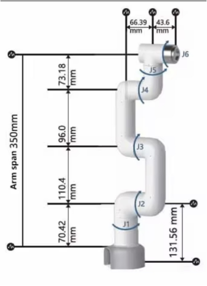
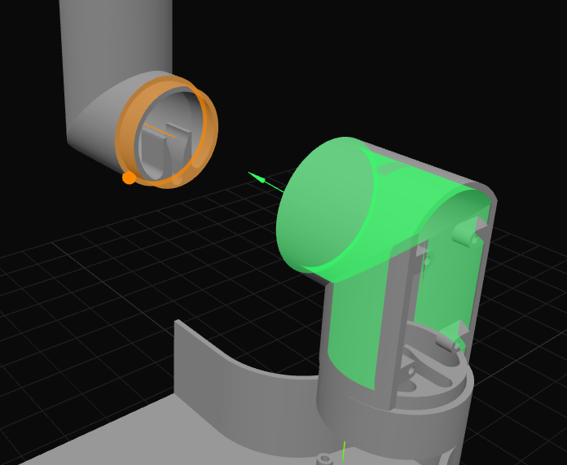
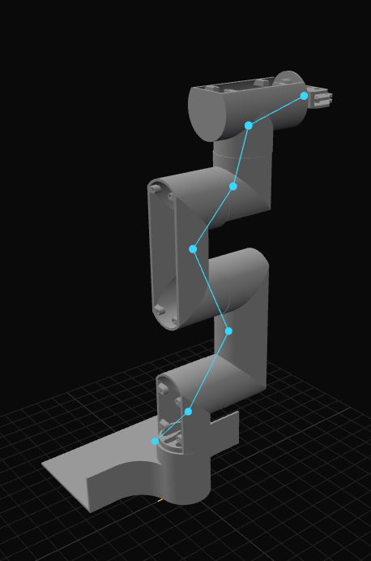
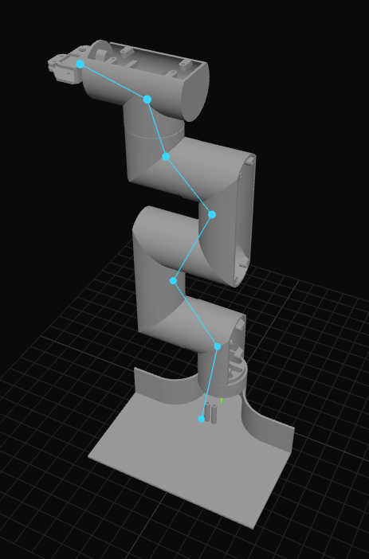
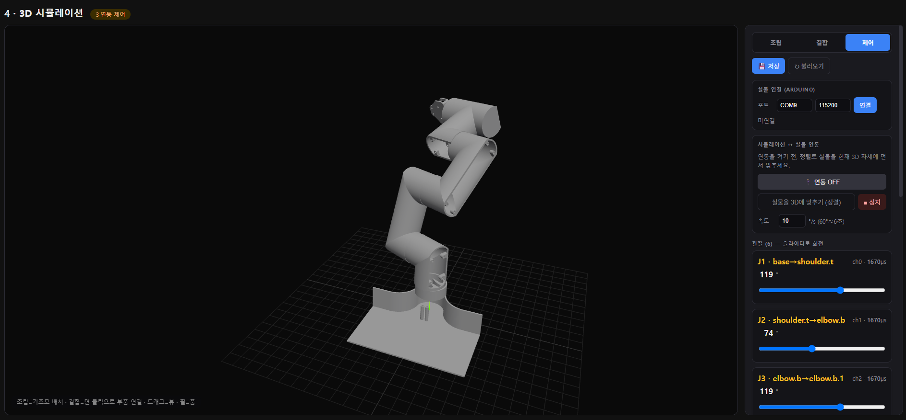

# 4페이지 — STL 3D 시뮬레이터 & 실물 연동

> 팀원이 만든 **STL 부품을 브라우저에서 직접 조립**해 6-DOF 로봇팔 디지털 트윈을 만들고,
> 관절을 움직여 **실제 로봇팔과 동시에 구동**하는 페이지. (`/arm3d/`)
> 구현: `armvision/templates/armvision/arm3d.html` (Three.js, 단일 파일) + 서버측 STL/저장/시리얼 엔드포인트.
> AI 서버 연동 **직전 단계**까지 완성된 상태.

---

## 0. 한눈에

```
cad/*.stl ──로드──▶ [조립] 부품 배치 ──▶ [결합] 면대면 관절 정의 ──▶ 저장(assembly.json)
                                                          │
                                                  [제어] 관절 슬라이더
                                                          ├─▶ 3D 로봇팔 회전 (항상)
                                                          └─▶ (연동 ON) 각도→펄스 → 시리얼 → 실제 서보
```

세 모드를 상단 세그먼트(**조립 · 결합 · 제어**)로 전환한다.

---

## 제작 방법 — 참조 설계 → CAD → 디지털 트윈

이 디지털 트윈은 **실물과 똑같은 STL 부품**으로 만들었다. 과정은 세 단계다.

**① 참조 설계 (목표 형상 확정)**
- C-브래킷 6-DOF 코봇 형태의 **참조 설계도/사진**을 기준으로, 어떤 링크(base·shoulder·elbow·wrist·endeffector·gripper)가 어떻게 연결되는지 정했다.
- 관절 축 방향(J1 베이스 회전, J2~J4 평면 피치, J5 롤, J6 그리퍼)도 이 설계에서 도출.



> 📷 실물 조립 사진(`docs/image/real-arm.jpg`)은 추가 예정.

**② CAD 모델링 → STL (팀원 작업)**
- 팀원이 CAD(예: Fusion/SolidWorks)로 각 링크를 **실측 치수(mm)** 로 모델링하고 **STL로 익스포트** → `cad/`에 18개 파일.
- 각 부품은 **자기 원점 기준**이라, 불러오면 한 곳에 겹쳐 보인다(아래 조립으로 정렬).

**③ 브라우저에서 조립 → 리깅 (본 시뮬레이터)**
- STL을 로드해 **조립 모드**로 대략 배치 → **결합 모드**에서 **면대면 결합**(맞물릴 원통 + 맞닿을 평면)으로 부품을 정확히 결합.
- 회전해야 할 곳은 **회전 결합**으로, 고정할 곳은 **고정 결합**으로 지정 → **6관절 리깅 완료**.
- 각 회전 결합에 **모터 채널·펄스(us0/us180)** 를 매핑해두면, 제어 모드에서 실물과 연동된다.






이렇게 만든 트윈은 **실측 STL 기반**이라, 시뮬레이션 자세가 곧 실물 자세에 대응한다(아래 **§6 제어 모드**).
사진 파일을 루트 `docs/image/`에 넣으면 위 자리에 링크가 연결된다 → [docs/image 목록](../../docs/image/README.md).

---

## 1. 부품 로드

- 서버 `cad/` 폴더의 STL 목록을 `/cad/list/`로 받아 `STLLoader`로 모두 로드(단위 mm).
- 각 부품은 자기 원점 기준이라 처음엔 한 곳에 겹쳐 보인다 → 조립 모드에서 배치한다.
- 우측 **부품** 목록에서 체크박스로 표시/숨김.

## 2. 조립 모드 (부품 배치)

- 부품 클릭 → **이동/회전 기즈모**(3D 핸들) 또는 우측 **위치(mm)/회전(°) 숫자 입력**으로 배치. 숫자 화살표는 1씩.
- 결합 전 대략적인 자리/방향만 맞추면 된다(정밀 정렬은 결합이 담당).
- **고정 그룹 통째 이동:** 결합을 "고정"한 부품들은 하나의 강체로 묶여, 조립 모드에서 한 부품만 잡아 끌어도 그룹 전체가 같이 이동·회전한다(내부 결합 중심선도 동행).

## 3. 결합 모드 (면대면 관절) — CATIA 방식

두 부품을 **공유 원통축(동심) + 맞닿는 평면(면일치)** 으로 결합한다. 우측 4개 슬롯을 채우고 **결합 실행**:

| 슬롯 | 클릭 대상 |
|------|-----------|
| 원통 A / 원통 B | 두 부품에서 **맞물릴 원통면** (축 정렬용) |
| 평면 A / 평면 B | 두 부품에서 **맞닿을 평면** (깊이 정렬용) |

- **가상 원통 인식:** 원통면을 클릭하면, 클릭한 **원통 하나 전체**를 영역성장으로 잡는다. 조건 = "부드럽게 연결 + 법선이 축에 수직". 끝면/평면은 자동 제외되고, **축이 꺾이면(ㄱ·ㄷ 형태의 다른 원통) 자동으로 분리**된다. 잡힌 면은 반투명 색(A=초록, B=주황)으로 표시.
- **결합 수학:** ① 동심(B의 축을 A의 축에 정렬) → ② 축 일직선(수직 오프셋 제거) → ③ 면일치(평면이 만나도록 축 따라 이동).
- **종류:** **회전(revolute)** = 관절 / **고정(fixed)** = 강체 결합.

### 결합(관절) 편집기
결합 목록에서 항목 선택 시:
- **각도°** min/max — 소프트웨어 관절 한계.
- **모터** channel · us0(0°µs) · us180(180°µs) — 각도→펄스 변환 파라미터(관절별 실측값 입력, → [servo_calibration.md](../../arduino/docs/servo_calibration.md)).
- **위치보정 X/Y/Z** — 결합 후 부품(과 하위 트리)을 축 방향뿐 아니라 **자유롭게 미세 이동**. 이때 **중심선(pivot)도 함께 이동**해 회전축이 부품을 따라간다.
- **roll°** — 공유 축을 기준으로 회전.
- **🔒 고정** — 이 결합을 강체로 잠금(조립 모드에서 통째 이동 대상). 잠긴 부품 사이는 **시안색 연결선**으로 표시.
- **테스트 회전 슬라이더** — 3D에서 관절을 미리 돌려봄(중립 90°).

## 4. 저장 / 불러오기

- **저장**: 부품 위치/회전/표시 + 모든 결합(부모·자식·종류·pivot·axis·각도범위·offset·roll·locked·motor)을 `cad/assembly.json`에 저장(`/arm3d/save/`).
- **불러오기**: 페이지 로드시 `/arm3d/load/`로 복원. 저장 시 관절은 **중립(90°)** 으로 정규화되어 저장된다.
- 라운드트립(저장→불러오기) 무손실 검증 완료.

## 5. 계층/리깅 (rebuild)

- 결합 관계로 부모→자식 트리를 만들고, 회전 결합마다 **pivot 그룹**을 중심선 위치에 생성한다.
- `applyAngles()` 가 각 회전 결합의 pivot 그룹을 `axis` 기준 `(angle-90)°` 회전 → 3D 관절 구동.
- 평면화(`worldRoot.attach`) 시 부품 scale을 1로 리셋·쿼터니언 정규화 → **결합 반복해도 크기가 작아지지 않음**(부동소수 누적 방지).

## 6. 제어 모드 — 실물 ↔ 3D 연동

> 시뮬레이션으로 동작을 미리 보고, **연동을 켜면 3D와 실물이 동시에** 움직인다. **3D → 실물 단방향**(서보 피드백 없음, 3D가 기준).



1. **실물 연결** — 포트(기본 COM9)·보레이트(115200) 입력 → 연결. (`/arm/connect/`)
2. **관절 슬라이더 J1~J6** — 슬라이더는 **목표각**만 정하고, 램프가 천천히 이동시킨다(아래 속도 제한).
3. **정렬** — 실물 명령각을 현재 3D 자세로 **같은 속도로 천천히** 이동(라이브 전 정렬용).
4. **연동 ON/OFF** — 기본 OFF. ON일 때만 슬라이더가 실물을 구동(바뀐 펄스만 ~50ms 간격 전송).
5. **정지** — 연동 즉시 OFF + 목표를 현재 위치로 고정(그 자리에서 멈춤).
6. **속도(°/s)** — 기본 **10°/s = 60°에 6초**. 정렬·연동 모두 이 속도로 이동.

### 속도 제한 (2단 램프)
- **3D 표시각** → 슬라이더 목표로 이동, **실물 명령각** → 3D 표시각으로 같은 속도로 따라감(펄스는 명령각 기준).
- 서보 위치 피드백이 없어 "마지막 명령각"을 실물 위치 기준으로 사용 → 시작 시 실물을 3D 휴식 자세에 두면 첫 정렬부터 자연스럽다.

### 자동 재연결
- 서보 전류 브라운아웃/USB 글리치로 연결이 끊기면, 서버가 **자동으로 2초마다 재연결**(수동 버튼 불필요). 끊김 시 화면에 "⟳ 재연결 중…", 복구되면 현재 자세로 자동 정렬.
- `write_timeout`로 쓰기가 막혀도 서버가 멎지 않음.

### 각도 → 펄스 변환 (노트북이 담당)
```
us = us0 + ((180 − angle) / 180) × (us180 − us0)   # 시뮬↔실물 방향이 반대라 항상 미러
```
> angle 은 [min,max]로 클램프. 아두이노로는 기존 테스트 펌웨어 명령 **`u <channel> <us>`** 를 그대로 전송 → **펌웨어 수정 불필요**.

---

## 7. 결합(관절) 데이터 모델 (`assembly.json` 의 mate)

```jsonc
{
  "parent": "elbow.b.stl", "child": "wrist.b.stl",
  "type": "rev",                 // 'rev'(회전) | 'fix'(고정)
  "pivot": [x,y,z], "axis": [x,y,z],   // 회전 중심선(월드)
  "angle": 90, "min": 0, "max": 180,
  "offset": [0,0,0], "roll": 0,  // 위치 미세보정
  "locked": false,               // 강체 잠금
  "motor": { "channel": 3, "us0": 690, "us180": 2800 }  // 각도→펄스
}
```

## 8. 관련 파일 / 엔드포인트

| 구분 | 위치 |
|------|------|
| 프런트(전체 로직) | `armvision/templates/armvision/arm3d.html` |
| STL 서빙 | `/cad/list/`, `/cad/<name>` |
| 조립 저장/불러오기 | `/arm3d/save/`, `/arm3d/load/` → `cad/assembly.json` |
| 시리얼 브리지 | `armvision/arduino_bridge.py` (pyserial) |
| 실물 제어 API | `/arm/status/`, `/arm/connect/`, `/arm/disconnect/`, `/arm/move/` |

---

## 9. 알려진 한계 / 다음

- **유격**: 면 피팅 오차로 결합부에 미세 유격. 위치보정(XYZ/roll)으로 보정 가능.
- **경계 결합 pivot**: 고정 그룹과 *바깥* 부품을 잇는 결합의 pivot은 통째 이동 시 자동 갱신하지 않음(그룹 내부만). 리깅 단계에서 정리.
- **단방향 연동**: 실물 서보에 위치 피드백이 없어 3D→실물만. (마커 추적으로 보정은 [aruco_markers.md](aruco_markers.md) 단계 ⑥에서)
- **실물 테스트 체크**: 관절별 채널·us0/us180 실측값 입력 확인, 첫 구동은 모터 1개씩·좁은 가동범위로.
- **다음**: 자연어/AI(Gemma) 명령 → 관절각 목표 → 이 슬라이더 경로로 구동(3페이지 통합).
