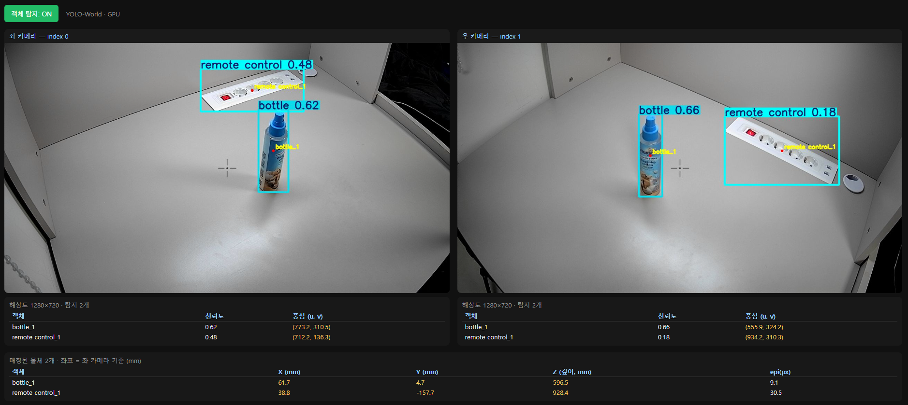

# 노트북 웹앱 (Django) — 기능 명세

> 노트북 제어 허브의 **웹 UI**. 비전·캘리브레이션·로봇 제어를 브라우저에서 다룬다.
> 프로젝트 `config`, 앱 `armvision`. `python manage.py runserver` → http://127.0.0.1:8000/
> 상단 네비게이션으로 4개 페이지 이동.

---

## 페이지 구성 (4개)

### 1 · 카메라 · 탐지  `/`

- **좌/우 카메라 선택** — **🔄 카메라 스캔**으로 노트북의 카메라를 찾아(가능하면 장치 이름까지) 드롭다운에서 좌·우를 고른다. 선택은 서버에 저장(`armvision/cam_config.json`)되어 탐지·스테레오·캘리브레이션에 **공통 적용**. USB 재연결로 인덱스가 바뀌어도 다시 고르면 됨.
  - 장치 목록은 **pygrabber**(DirectShow)로 카메라를 열지 않고 읽는다 → 여러 웹캠 동시 점유로 일부를 놓치는 문제 없음. 없으면 인덱스 직접 탐색으로 폴백.
  - **주의:** 같은 모델 웹캠이 index 0·2처럼 **중복 enumerate** 될 수 있음(같은 물리 장치). 둘을 동시에 좌/우로 쓰면 한쪽이 검은 화면 → 서로 다른 장치를 고를 것.
- 선택한 2대 **MJPEG 실시간** 표시, 화면 중앙 **십자선**. 카메라 스레드는 **자가 치유**(점유가 풀리면 자동 재오픈).
- **객체 탐지 토글** — YOLO-World(GPU). 박스 + 중심점 + **객체 id(`class_n`, 좌→우)**.
- **2D 좌표표**(카메라별, 1초 갱신): 객체 id · 신뢰도 · 중심(u,v).
- **3D 좌표표**: 캘리브레이션 완료 시 **자동 활성** — 좌·우 매칭·삼각측량한 (X,Y,Z) mm.

### 2 · 캘리브레이션 위저드  `/setup/`
6단계 인터랙티브. **카메라 먼저 고정·보정 → 로봇 설치**( ①②③ → 로봇 → ④⑤⑥ ).
좌/우 카메라는 **1페이지에서 선택한 설정(`cam_config.json`)을 그대로 사용** — 화면·코너수·촬영·캘리브레이션 모두 동일 카메라.
1. **ChArUco 촬영** — 양 카메라 코너 오버레이 + 캡처(좌·우 동시) + 실시간 코너 수. ✅ 동작
2. **카메라 캘리브레이션** — 내부 K·왜곡 + 스테레오 R·T 산출, 결과 표시. ✅ 동작
3. **3D 검증** — 보드 30mm 복원 오차/스케일. ✅ 동작
4. **로봇 배치 & 베이스 마커** — 골격(마커 부착 후 구현)
5. **카메라→로봇 변환 T** — 골격
6. **관절 위치 & 작업공간** — 골격
- 절차 상세: [setup_procedure.md](setup_procedure.md), 파이프라인: [coordinate_3d_pipeline.md](coordinate_3d_pipeline.md)

### 3 · 자연어 제어  `/control/`
- 한국어 명령으로 로봇팔 구동하는 화면. **현재 골격(채팅 UI)만.**
- AI 서버(Whisper·Gemma) 완료 후 **노트북·아두이노·AI 서버 통합 단계**에서 gRPC 클라이언트 + DSL 실행기와 연결.

### 4 · 3D 시뮬레이터 & 실물 연동  `/arm3d/`
- **Three.js** 기반. 팀원 **STL 부품을 직접 조립**해 디지털 트윈을 만들고 **실물과 동시 구동**. 세 모드:
  - **조립** — 기즈모/숫자로 부품 배치. 고정 그룹은 통째 이동.
  - **결합** — CATIA식 **면대면(원통 동심 + 평면 일치)** 으로 회전/고정 관절 정의. 가상 원통 자동 인식. 관절별 모터 매핑·위치보정·고정.
  - **제어** — 관절 슬라이더로 3D 구동 + **연동 ON 시 실물 서보 동시 구동**(정렬 후 라이브, ~30ms 실시간 전송). 각도→펄스는 노트북이 변환, 아두이노엔 `u ch us` 전송(펌웨어 수정 불필요).
- 조립 결과는 `cad/assembly.json`에 저장/복원. **6관절 리깅 완료, AI 연동 직전 단계.**
- 상세: **[arm3d_simulator.md](arm3d_simulator.md)**

---

## 주요 엔드포인트

| 경로 | 용도 |
|------|------|
| `/video_feed/?cam=&detect=&charuco=` | MJPEG 스트림 (탐지/ChArUco 오버레이) |
| `/detections/?cam=` | 카메라별 2D 탐지 JSON |
| `/positions3d/` | 좌·우 매칭·삼각측량 3D JSON |
| `/cameras/` · `/cameras/config/` | 카메라 목록 / 좌·우 선택 저장 |
| `/setup/capture/` · `/setup/run_calibration/` · `/setup/run_validation/` · `/setup/state/` · `/setup/charuco_status/` | 위저드 백엔드 |
| `/cad/list/` · `/cad/<name>` | STL 목록 / 파일 서빙 |
| `/arm3d/load/` · `/arm3d/save/` | 조립(`cad/assembly.json`) 불러오기/저장 |
| `/arm/status/` · `/arm/connect/` · `/arm/disconnect/` · `/arm/move/` | 실물 로봇팔 시리얼 연동 |

---

## 모듈

| 파일 | 역할 |
|------|------|
| `armvision/camera.py` | 카메라 공유 스레드(자가치유) + MJPEG + 십자선 + 카메라 목록/선택(`cam_config.json`) |
| `armvision/detector.py` | YOLO-World 탐지 + 객체 id |
| `armvision/charuco.py` | ChArUco 검출/오버레이 (DICT_5X5_100, 6×8, 30/23mm) |
| `armvision/stereo3d.py` | 좌·우 매칭 + 삼각측량 3D (지연 로딩) |
| `armvision/arduino_bridge.py` | 실물 로봇팔 시리얼(pyserial, COM9) — 펄스 전송 |
| `armvision/views.py`, `templates/` | 페이지·엔드포인트 |
| `calibration/calibrate_stereo.py`, `validate_triangulation.py` | 캘리브레이션·검증 |
| `calibration/make_targets.py`, `make_arm_markers.py` | 인쇄용 ChArUco/ArUco PDF |

> 의존성: `ultralytics`(YOLO-World)·`opencv-python`·`pyserial`·`pygrabber`(카메라 이름), torch(CUDA).

---

## 구현 완료 / 예정

**완료**
- ✅ **STL 기반 3D 시뮬레이터**(4페이지): 조립·면대면 결합·6관절 리깅·저장. → [arm3d_simulator.md](arm3d_simulator.md)
- ✅ **실물 연동**(`arduino_bridge.py`): 시리얼 연결 + **각도→펄스 변환**(관절별 실측, [../../arduino/docs/servo_calibration.md](../../arduino/docs/servo_calibration.md)) + 전송 → 4페이지 슬라이더가 **3D+실물 동시** 구동.
- ✅ **카메라 선택**(1페이지): 좌/우 카메라를 노트북 장치에서 선택·저장.

**예정**
- **단계 ⑤⑥**: 베이스/추적 ArUco 마커로 카메라→로봇 변환 T, 관절 추적([aruco_markers.md](aruco_markers.md)).
- **3페이지 통합**: AI 서버(Whisper·Gemma) → gRPC + DSL 실행기 → 4페이지 연동 경로로 구동.
- **이진 프로토콜**: 현재 ASCII `u ch us` → CommandPacket+CRC([../../docs/serial_protocol.md](../../docs/serial_protocol.md)).
